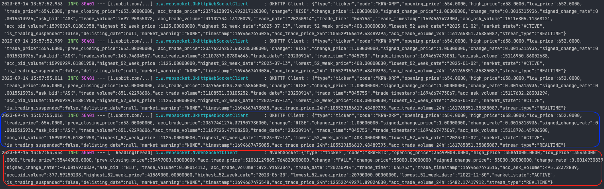

# 목적
WebSocket Client 사용방법

## 예제소스
### https://github.com/devHjlee/devHjBlog/tree/main/WebSocketClient

## WebSocket ?
* 웹 애플리케이션에서 양방향 통신을 가능하게 하는 통신 프로토콜 및 API이며 HTTP와 마찬가지로 웹 브라우저와 웹 서버 간의 통신을 위해 사용
* 양방향 통신: 클라이언트(웹 브라우저)와 서버 간에 양방향 통신을 제공. 클라이언트나 서버가 데이터를 보낼 때 언제든지 연결을 통해 상호 작용할 수 있음을 의미하며 실시간 채팅, 온라인 게임, 주식 시장 데이터 업데이트 등의 기능을 구현
* 낮은 오버헤드: 기존의 HTTP 프로토콜과 비교하여 상대적으로 낮은 오버헤드를 가지고 있으며 데이터를 주고받을 때 추가적인 HTTP 요청 및 응답 헤더가 필요하지 않기 때문
* 표준화: 웹 소켓은 국제 인터넷 표준화 기구(IETF)에서 개발 및 표준화되었으며 다양한 웹 브라우저와 웹 서버에서 호환성이 있고, 다양한 프로그래밍 언어 및 플랫폼에서 지원
* 이벤트 기반: 웹 소켓은 이벤트 기반 아키텍처를 사용하며, 클라이언트나 서버에서 이벤트가 발생할 때마다 메시지를 주고받을 수 있음
* 보안: 웹 소켓은 웹 보안 프로토콜 (HTTPS) 위에서 동작하며, 보안 연결을 제공할 수 있습니다. 또한 서버와 클라이언트 간의 데이터 전송은 암호화될 수 있음

## 개발환경
* IDE : IntelliJ
* Jdk : OpenJdk 11
* gradle
* spring boot : 2.7.16


### 예제 소스
#### NvWebSocket

``` java    
@Slf4j
@Component
@RequiredArgsConstructor
public class NvWebSocketClient {
    WebSocket ws = null;

    @PostConstruct
    public void connect() throws WebSocketException, IOException, InterruptedException {

        final String SERVER = "wss://api.upbit.com/websocket/v1";
        final int TIMEOUT = 5000;

        JsonArray root = new JsonArray();
        JsonObject type = new JsonObject();
        JsonArray codesObj = new JsonArray();

        codesObj.add("KRW-BTC");
        root.add(new JsonObject());
        root.get(0).getAsJsonObject().addProperty("ticket", UUID.randomUUID().toString());
        type.addProperty("type", "ticker");
        type.add("codes", codesObj);
        root.add(type);

        ws = new WebSocketFactory()
                .setConnectionTimeout(TIMEOUT)
                .createSocket(SERVER)
                .addListener(new WebSocketAdapter() {

                    public void onBinaryMessage(WebSocket websocket, byte[] binary) {
                        log.info("NvWebSocket:"+new String(binary));

                    }

                    public void onTextMessage(WebSocket websocket, String message) {}

                    public void onDisconnected(WebSocket websocket,
                                               WebSocketFrame serverCloseFrame, WebSocketFrame clientCloseFrame,
                                               boolean closedByServer) {
                    }
                    public void onError(WebSocket websocket, WebSocketException cause) {
                    }
                })
                .addExtension(WebSocketExtension.PERMESSAGE_DEFLATE)
                .connect();
        ws.sendText(root.toString());
    }
}
```   

* 예를들어 이벤트인 메시지 발송이 오래 걸리는 상황에서 비동기 처리시 메인 로직은 이벤트의 응답을 기다리지 않아도 된다.    

#### OkHttp3

``` java    

@Slf4j
@Component
@RequiredArgsConstructor
public class OkHttpWebSocketClient {
    private WebSocket ws = null;

    @PostConstruct
    public void connect() throws InterruptedException {
        final OkHttpClient client = new OkHttpClient();
        JsonArray root = new JsonArray();
        JsonObject type = new JsonObject();
        JsonArray codesObj = new JsonArray();

        codesObj.add("KRW-XRP");
        root.add(new JsonObject());
        root.get(0).getAsJsonObject().addProperty("ticket", UUID.randomUUID().toString());
        type.addProperty("type", "ticker");
        type.add("codes", codesObj);
        root.add(type);

        Request request = new Request.Builder()
                .url("wss://api.upbit.com/websocket/v1")
                .addHeader("options", root.toString())
                .build();
        log.info(root.toString());
        ws = client.newWebSocket(request, new WebSocketListener() {

            @Override
            public void onOpen(@NotNull WebSocket webSocket, @NotNull okhttp3.Response response) {
                log.info("WebSocket Open!!!");
                webSocket.send(Objects.requireNonNull(webSocket.request().header("options")));
            }

            @Override
            public void onMessage(@NotNull WebSocket webSocket, @NotNull ByteString bytes) {
                log.info("OKHTTP Client : " +bytes.string(StandardCharsets.UTF_8));
            }

            @Override
            public void onMessage(@NotNull WebSocket webSocket, @NotNull String text) { }

            @Override
            public void onClosed(@NotNull WebSocket webSocket, int code, @NotNull String reason) { }

            @Override
            public void onFailure(@NotNull WebSocket webSocket, @NotNull Throwable t, okhttp3.Response response) { }
        });

        client.dispatcher().executorService().awaitTermination(5, TimeUnit.SECONDS);
        ws.send(root.toString());
    }

}
```   

* 예를들어 이벤트인 메시지 발송이 오래 걸리는 상황에서 비동기 처리시 메인 로직은 이벤트의 응답을 기다리지 않아도 된다.    

* 실행 결과   
  


