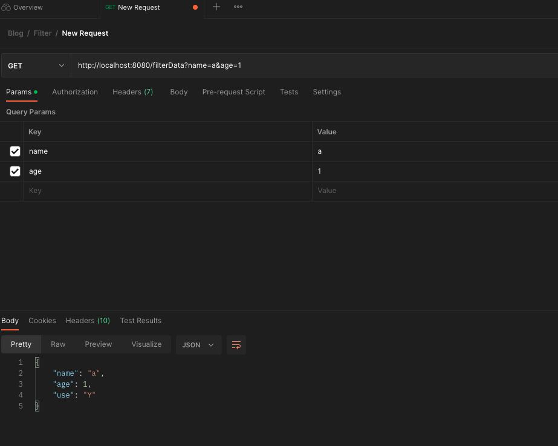

# 목적
Filter 활용.

## 예제소스
### https://github.com/devHjlee/devHjBlog/tree/main/filter-interceptor-aop
## Filter


- 필터는 디스패처서블릿에 요청이 전달되기 전/후 에 url 패턴에 맞는 모든 요청에 대해 부가작업을 처리 할 수 있는 기능을 제공합니다.
* `javax.servlet.Filter`는 Java Servlet API의 일부로, 웹 애플리케이션에서 들어오는 요청과 해당 응답을 가로채고 조작하는 데 사용되는 인터페이스입니다. 필터는 요청 전후에 특정 작업을 수행하거나 응답을 수정하는 데 유용합니다. 주요 목적은 애플리케이션의 공통된 작업을 중앙에서 관리하고 코드 중복을 피하는 것입니다.
* 필터는 웹 애플리케이션의 요청 및 응답 처리 파이프라인에서 동작하며, 여러 필터가 연속적으로 체인으로 연결될 수 있습니다. 각 필터는 요청이나 응답에 대해 작업을 수행한 후 체인의 다음 필터로 제어를 전달하거나, 체인의 끝에 도달하면 최종적으로 서블릿에게 제어를 전달합니다.
* 일반적인 필터 작업에는 다음과 같은 것들이 있을 수 있습니다:
  * 요청/응답 로깅: 요청 및 응답 내용을 기록하거나 모니터링하는 용도로 사용할 수 있습니다.
  * 인증 및 권한 부여: 요청에 대한 인증 및 권한 부여 작업을 수행할 수 있습니다.
  * 데이터 변환: 요청 데이터나 응답 데이터를 변환하거나 형식을 조작할 수 있습니다.
  * 캐싱: 응답을 캐시하여 성능을 향상시킬 수 있습니다.
  * 예외 처리: 예외 상황에 대한 처리를 수행할 수 있습니다.
* `javax.servlet.Filter` 인터페이스를 구현하는 필터 클래스는 `doFilter()` 메서드를 오버라이드해야 합니다. 이 메서드에서 실제 필터링 작업을 수행하고, 요청을 변경하거나 응답을 조작한 후 `FilterChain` 객체의 `doFilter()` 메서드를 호출하여 체인의 다음 필터로 제어를 전달합니다.
* Dispatcher Servlet에 요청이 전달되기 전 / 후에 url 패턴에 맞는 모든 요청에 대해 부가 작업을 처리할 수 있는 기능을 제공
* 필터는 Request와 Response를 조작할 수 있지만, 인터셉터는 조작 불가능
* 주요 메소드
  - init() - 필터 인스턴스 초기화 시 실행되는 메서드
  - doFilter() - 클라이언트의 요청/응답 처리 시 실행되는 메서드
  - destroy() - 필터 인스턴스가 제거될 때 실행되는 메서드

- Spring 을 통한 다양한 구현방법
  -  @Configuration + FilterRegistrationBean : 예시 작성
  -  @Component
  -  @WebFilter + @ServletComponentScan
  -  @WebFilter + @Component(주의사항 : https://velog.io/@bey1548/WebFilter)

## 개발환경
* IDE : IntelliJ
* Jdk : OpenJdk 11
* gradle
* spring boot : 2.7.11

- 프로젝트 구조
  

#### FilterConfig
``` java    
@Configuration  
public class FilterConfig {  
  
    @Bean  
    public FilterRegistrationBean<CorsFilter> corsFilter() {  
        FilterRegistrationBean<CorsFilter> registrationBean = new FilterRegistrationBean<>(new CorsFilter());  
        registrationBean.setUrlPatterns(Arrays.asList("/*")); // 필터 적용 url        registrationBean.setOrder(1); // 필터 적용 순서  
  
        return registrationBean;  
    }  
  
    @Bean  
    public FilterRegistrationBean<CustomRequestFilter> customRequestFilter() {  
        FilterRegistrationBean<CustomRequestFilter> registrationBean = new FilterRegistrationBean<>(new CustomRequestFilter());  
        registrationBean.setUrlPatterns(Arrays.asList("/*")); // 필터 적용 url        registrationBean.setOrder(2); // 필터 적용 순서  
  
        return registrationBean;  
    }  
  
    @Bean  
    public FilterRegistrationBean<CustomResponseFilter> customResponseFilter() {  
        FilterRegistrationBean<CustomResponseFilter> registrationBean = new FilterRegistrationBean<>(new CustomResponseFilter());  
        registrationBean.setUrlPatterns(Arrays.asList("/*")); // 필터 적용 url        registrationBean.setOrder(3); // 필터 적용 순서  
  
        return registrationBean;  
    }  
}  
```  


#### Filter
``` java    
@Slf4j  
public class CustomRequestFilter implements Filter {  
  
    @Override  
    public void init(FilterConfig filterConfig) throws ServletException {  
        // 초기화할 때 실행  
        log.info("Custom Request init START");  
    }  
  
    @Override  
    public void doFilter(ServletRequest request, ServletResponse response, FilterChain filterChain)  
            throws IOException, ServletException {  
        HttpServletRequest req = (HttpServletRequest) request;  
  
        // GET 방식 요청 중 '/filterData' 경로에 대해서만 파라미터 변경  
        if (req.getMethod().equals("GET") && req.getRequestURI().equals("/filterData")) {  
            // 요청을 위한 커스텀 래퍼(wrapper) 생성  
            CustomRequestWrapper requestWrapper = new CustomRequestWrapper(req){  
                @Override  
                public String getServerName() {  
                    return "test.com";  
                }  
            };  
  
            // 원하는 대로 파라미터 수정  
            requestWrapper.setParameter("name", req.getParameter("name"));  
            requestWrapper.setParameter("age", req.getParameter("age"));  
            requestWrapper.setParameter("user", "1");  
  
            // 수정된 요청으로 계속 진행  
            log.info("CustomRequestFilter Start");  
            filterChain.doFilter(requestWrapper, response);  
            log.info("CustomRequestFilter End");  
        } else {  
            // 다른 요청에 대해서는 기존 요청 그대로 전달  
            filterChain.doFilter(request, response);  
        }  
    }  
  
    @Override  
    public void destroy() {  
        // 종료될 때 실행  
        log.info("Custom Request init Destory");  
    }  
}
```  


#### Wrapper
``` java    
public class CustomRequestWrapper extends HttpServletRequestWrapper {  
  
    private final Map<String, String[]> modifiedParameters;  
  
    public CustomRequestWrapper(HttpServletRequest request) {  
        super(request);  
        this.modifiedParameters = new HashMap<>(request.getParameterMap());  
    }  
  
    @Override  
    public String getParameter(String name) {  
        String[] values = modifiedParameters.get(name);  
        return (values != null && values.length > 0) ? values[0] : null;  
    }  
  
    @Override  
    public Map<String, String[]> getParameterMap() {  
        return Collections.unmodifiableMap(modifiedParameters);  
    }  
  
    @Override  
    public Enumeration<String> getParameterNames() {  
        return Collections.enumeration(modifiedParameters.keySet());  
    }  
  
    @Override  
    public String[] getParameterValues(String name) {  
        return modifiedParameters.get(name);  
    }  
  
    public void setParameter(String name, String value) {  
        modifiedParameters.put(name, new String[]{value});  
    }  
}
```  


#### Test Controller

``` java    
@Slf4j  
@RestController  
public class HelloController {  
  
    @GetMapping("/filterData")  
    public ResponseEntity<Map<String, Object>> filterData(HttpServletRequest request, @RequestParam String name, @RequestParam int age) {  
        Map<String, Object> resMap = new HashMap<>();  
        resMap.put("name", name);  
        resMap.put("age", age);  
        log.info(request.getServerName());  
        return new ResponseEntity<Map<String,Object>>(resMap, HttpStatus.OK);  
    }  
  
    @GetMapping("/noFilterData")  
    public ResponseEntity<Map<String, Object>> noFilterData(@RequestParam String name, @RequestParam int age) {  
        Map<String, Object> resMap = new HashMap<>();  
        resMap.put("name", name);  
        resMap.put("age", age);  
  
        return new ResponseEntity<Map<String,Object>>(resMap, HttpStatus.OK);  
    }  
} 
```  

#### 실행 결과
- http://localhost:8080/filterData?name=a&age=1 호출
- CustomRequestFilter doFilter 를 통해 요청값의 ServerName 을 변경하고 user 파라미터를 추가하였다
- CustomResponseFilter doFilter 를 통해 응답값의 파라미터중 user 의 값을 1에서 Y 로 변경하였다.





### 참고
* https://velog.io/@ksk7584/Filter%EB%A5%BC-%EB%93%B1%EB%A1%9D%ED%95%98%EB%8A%94-4%EA%B0%80%EC%A7%80-%EB%B0%A9%EB%B2%95
* https://mangkyu.tistory.com/221
* Chat GPT
