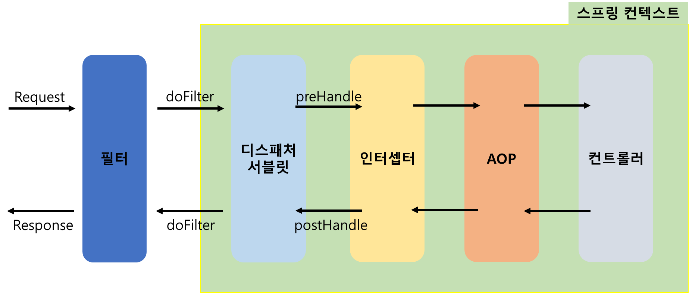
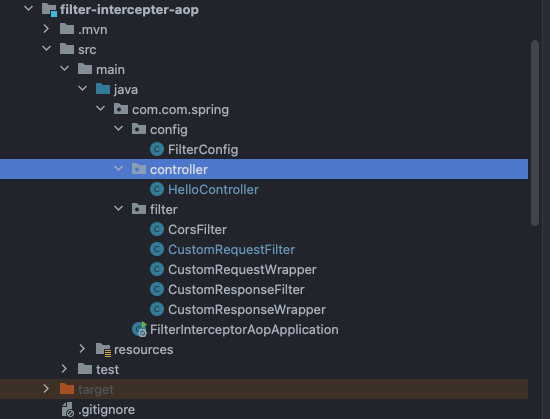
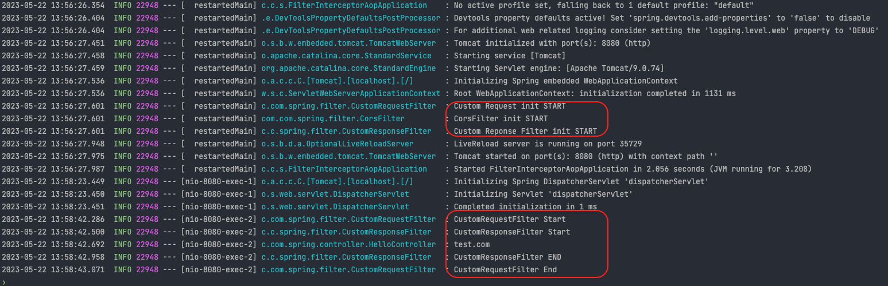
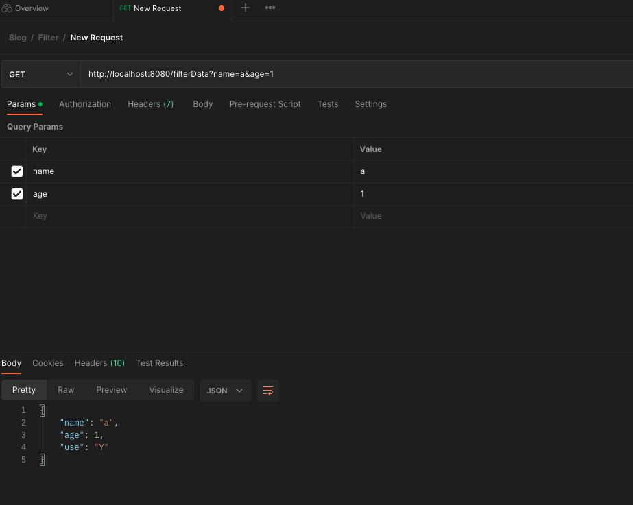
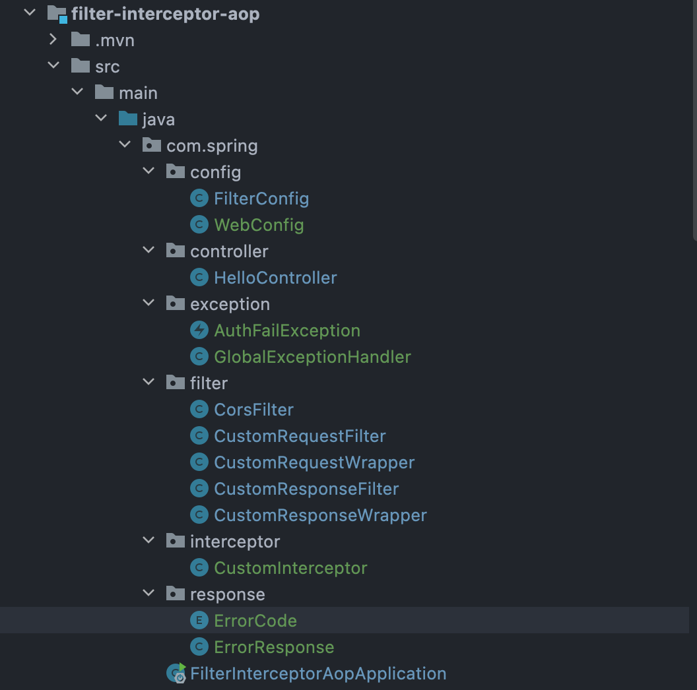
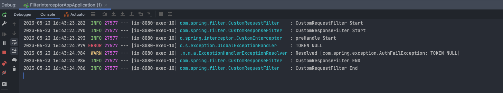
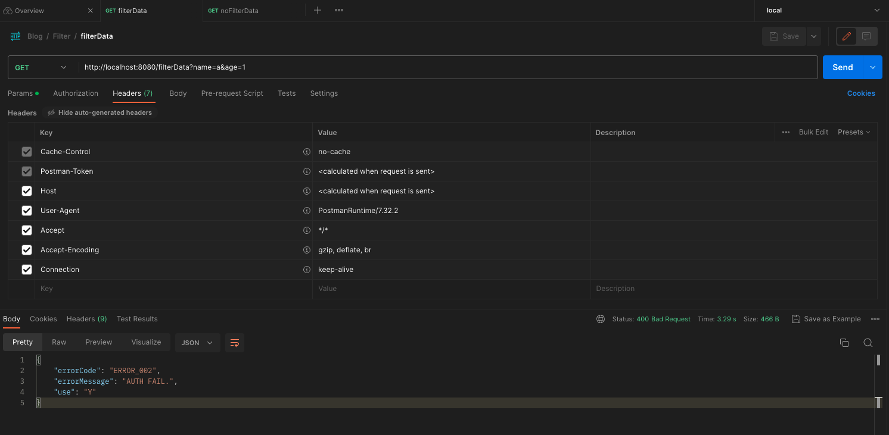
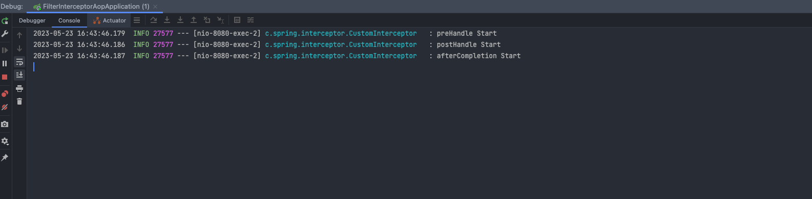
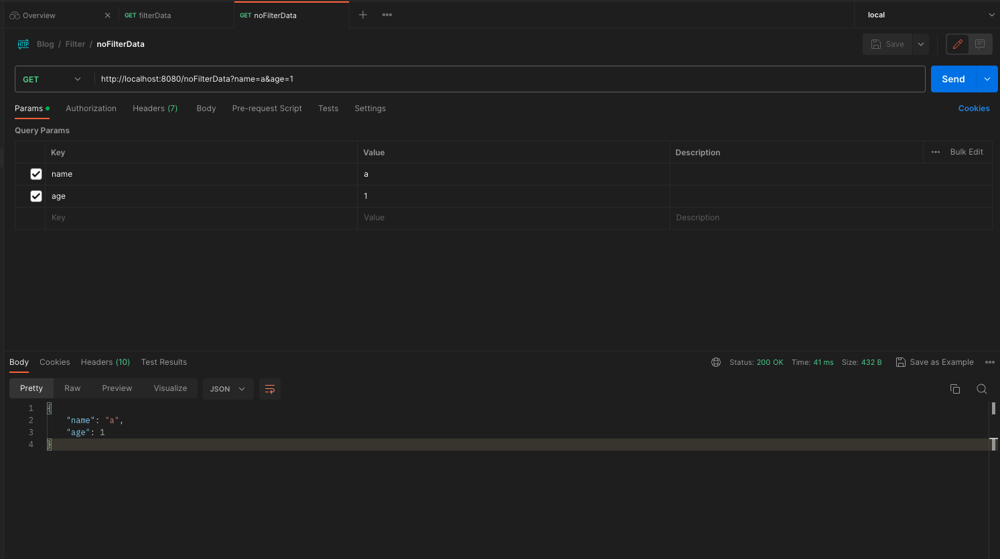

# 목적
Filter 활용.

## 예제소스
### https://github.com/devHjlee/devHjBlog/tree/main/filter-interceptor-aop
## Filter



- 필터는 디스패처서블릿에 요청이 전달되기 전/후 에 url 패턴에 맞는 모든 요청에 대해 부가작업을 처리 할 수 있는 기능을 제공합니다.
* `javax.servlet.Filter`는 Java Servlet API의 일부로, 웹 애플리케이션에서 들어오는 요청과 해당 응답을 가로채고 조작하는 데 사용되는 인터페이스입니다. 필터는 요청 전후에 특정 작업을 수행하거나 응답을 수정하는 데 유용합니다. 주요 목적은 애플리케이션의 공통된 작업을 중앙에서 관리하고 코드 중복을 피하는 것입니다.
* 필터는 웹 애플리케이션의 요청 및 응답 처리 파이프라인에서 동작하며, 여러 필터가 연속적으로 체인으로 연결될 수 있습니다. 각 필터는 요청이나 응답에 대해 작업을 수행한 후 체인의 다음 필터로 제어를 전달하거나, 체인의 끝에 도달하면 최종적으로 서블릿에게 제어를 전달합니다.
* 일반적인 필터 작업에는 다음과 같은 것들이 있을 수 있습니다:
  * 요청/응답 로깅: 요청 및 응답 내용을 기록하거나 모니터링하는 용도로 사용할 수 있습니다.
  * 인증 및 권한 부여: 요청에 대한 인증 및 권한 부여 작업을 수행할 수 있습니다.
  * 데이터 변환: 요청 데이터나 응답 데이터를 변환하거나 형식을 조작할 수 있습니다.
  * 캐싱: 응답을 캐시하여 성능을 향상시킬 수 있습니다.
  * 예외 처리: 예외 상황에 대한 처리를 수행할 수 있습니다.
* `javax.servlet.Filter` 인터페이스를 구현하는 필터 클래스는 `doFilter()` 메서드를 오버라이드해야 합니다. 이 메서드에서 실제 필터링 작업을 수행하고, 요청을 변경하거나 응답을 조작한 후 `FilterChain` 객체의 `doFilter()` 메서드를 호출하여 체인의 다음 필터로 제어를 전달합니다.
* Dispatcher Servlet에 요청이 전달되기 전 / 후에 url 패턴에 맞는 모든 요청에 대해 부가 작업을 처리할 수 있는 기능을 제공
* 필터는 Request와 Response를 조작할 수 있지만, 인터셉터는 조작 불가능
* 주요 메소드
  - init() - 필터 인스턴스 초기화 시 실행되는 메서드
  - doFilter() - 클라이언트의 요청/응답 처리 시 실행되는 메서드
  - destroy() - 필터 인스턴스가 제거될 때 실행되는 메서드

- Spring 을 통한 다양한 구현방법
  - @Configuration + FilterRegistrationBean : 예시 작성
    -  FilterRegistrationBean은 스프링 애플리케이션 컨텍스트의 빈으로 등록되며, 스프링 빈에 직접 접근할 수 있는 기능을 제공합니다.
    -  FilterRegistrationBean을 사용하여 Filter를 등록하고, 필요한 스프링 빈에 주입하여 사용할 수 있습니다.
  - @Component
  - @WebFilter + @ServletComponentScan
  - @WebFilter + @Component(주의사항 : https://velog.io/@bey1548/WebFilter)

## 개발환경
* IDE : IntelliJ
* Jdk : OpenJdk 11
* maven
* spring boot : 2.7.11

- 프로젝트 구조
  

#### FilterConfig
``` java    
@Configuration  
public class FilterConfig {  
  
    @Bean  
    public FilterRegistrationBean<CorsFilter> corsFilter() {  
        FilterRegistrationBean<CorsFilter> registrationBean = new FilterRegistrationBean<>(new CorsFilter());  
        registrationBean.setUrlPatterns(Arrays.asList("/*")); // 필터 적용 url        registrationBean.setOrder(1); // 필터 적용 순서  
  
        return registrationBean;  
    }  
  
    @Bean  
    public FilterRegistrationBean<CustomRequestFilter> customRequestFilter() {  
        FilterRegistrationBean<CustomRequestFilter> registrationBean = new FilterRegistrationBean<>(new CustomRequestFilter());  
        registrationBean.setUrlPatterns(Arrays.asList("/*")); // 필터 적용 url        registrationBean.setOrder(2); // 필터 적용 순서  
  
        return registrationBean;  
    }  
  
    @Bean  
    public FilterRegistrationBean<CustomResponseFilter> customResponseFilter() {  
        FilterRegistrationBean<CustomResponseFilter> registrationBean = new FilterRegistrationBean<>(new CustomResponseFilter());  
        registrationBean.setUrlPatterns(Arrays.asList("/*")); // 필터 적용 url        registrationBean.setOrder(3); // 필터 적용 순서  
  
        return registrationBean;  
    }  
}  
```  


#### Filter
``` java    
@Slf4j  
public class CustomRequestFilter implements Filter {  
  
    @Override  
    public void init(FilterConfig filterConfig) throws ServletException {  
        // 초기화할 때 실행  
        log.info("Custom Request init START");  
    }  
  
    @Override  
    public void doFilter(ServletRequest request, ServletResponse response, FilterChain filterChain)  
            throws IOException, ServletException {  
        HttpServletRequest req = (HttpServletRequest) request;  
  
        // GET 방식 요청 중 '/filterData' 경로에 대해서만 파라미터 변경  
        if (req.getMethod().equals("GET") && req.getRequestURI().equals("/filterData")) {  
            // 요청을 위한 커스텀 래퍼(wrapper) 생성  
            CustomRequestWrapper requestWrapper = new CustomRequestWrapper(req){  
                @Override  
                public String getServerName() {  
                    return "test.com";  
                }  
            };  
  
            // 원하는 대로 파라미터 수정  
            requestWrapper.setParameter("name", req.getParameter("name"));  
            requestWrapper.setParameter("age", req.getParameter("age"));  
            requestWrapper.setParameter("user", "1");  
  
            // 수정된 요청으로 계속 진행  
            log.info("CustomRequestFilter Start");  
            filterChain.doFilter(requestWrapper, response);  
            log.info("CustomRequestFilter End");  
        } else {  
            // 다른 요청에 대해서는 기존 요청 그대로 전달  
            filterChain.doFilter(request, response);  
        }  
    }  
  
    @Override  
    public void destroy() {  
        // 종료될 때 실행  
        log.info("Custom Request init Destory");  
    }  
}
```  


#### Wrapper
``` java    
public class CustomRequestWrapper extends HttpServletRequestWrapper {  
  
    private final Map<String, String[]> modifiedParameters;  
  
    public CustomRequestWrapper(HttpServletRequest request) {  
        super(request);  
        this.modifiedParameters = new HashMap<>(request.getParameterMap());  
    }  
  
    @Override  
    public String getParameter(String name) {  
        String[] values = modifiedParameters.get(name);  
        return (values != null && values.length > 0) ? values[0] : null;  
    }  
  
    @Override  
    public Map<String, String[]> getParameterMap() {  
        return Collections.unmodifiableMap(modifiedParameters);  
    }  
  
    @Override  
    public Enumeration<String> getParameterNames() {  
        return Collections.enumeration(modifiedParameters.keySet());  
    }  
  
    @Override  
    public String[] getParameterValues(String name) {  
        return modifiedParameters.get(name);  
    }  
  
    public void setParameter(String name, String value) {  
        modifiedParameters.put(name, new String[]{value});  
    }  
}
```  


#### Test Controller

``` java    
@Slf4j  
@RestController  
public class HelloController {  
  
    @GetMapping("/filterData")  
    public ResponseEntity<Map<String, Object>> filterData(HttpServletRequest request, @RequestParam String name, @RequestParam int age) {  
        Map<String, Object> resMap = new HashMap<>();  
        resMap.put("name", name);  
        resMap.put("age", age);  
        log.info(request.getServerName());  
        return new ResponseEntity<Map<String,Object>>(resMap, HttpStatus.OK);  
    }  
  
    @GetMapping("/noFilterData")  
    public ResponseEntity<Map<String, Object>> noFilterData(@RequestParam String name, @RequestParam int age) {  
        Map<String, Object> resMap = new HashMap<>();  
        resMap.put("name", name);  
        resMap.put("age", age);  
  
        return new ResponseEntity<Map<String,Object>>(resMap, HttpStatus.OK);  
    }  
} 
```  

#### 실행 결과
- http://localhost:8080/filterData?name=a&age=1 호출
- CustomRequestFilter doFilter 를 통해 요청값의 ServerName 을 변경하고 user 파라미터를 추가하였다
- CustomResponseFilter doFilter 를 통해 응답값의 파라미터중 user 의 값을 1에서 Y 로 변경하였다.






### 참고
* https://velog.io/@ksk7584/Filter%EB%A5%BC-%EB%93%B1%EB%A1%9D%ED%95%98%EB%8A%94-4%EA%B0%80%EC%A7%80-%EB%B0%A9%EB%B2%95
* https://mangkyu.tistory.com/221
* Chat GPT


# Spring Interceptor 구현
# 목적
interceptor 활용 및 filter 차이점  
filter 정리글 : https://devhj.tistory.com/59

## 예제소스
### https://github.com/devHjlee/devHjBlog/tree/main/filter-interceptor-aop

## Interceptor

![[interceptor/Request.png]]

Interceptor(인터셉터)는 스프링 프레임워크에서 제공하는 기능으로, 웹 애플리케이션의 요청 처리 과정에서 컨트롤러 호출 전후에 추가적인 작업을 수행할 수 있도록 해줍니다. Interceptor는 주로 요청의 전/후 처리, 인증 및 권한 검사, 로깅, 캐싱 등의 공통적인 기능을 구현하기 위해 사용됩니다.

Interceptor의 주요 특징은 다음과 같습니다:

1.  HandlerInterceptor 인터페이스 구현:

  -   Interceptor는 `org.springframework.web.servlet.HandlerInterceptor` 인터페이스를 구현하여 작성됩니다.
  -   HandlerInterceptor 인터페이스는 preHandle(), postHandle(), afterCompletion() 세 가지 메서드를 제공합니다.
  -   preHandle() 메서드는 컨트롤러 실행 전에 호출되며, postHandle() 메서드는 컨트롤러 실행 후에 호출되고, afterCompletion() 메서드는 뷰가 렌더링 된 후에 호출됩니다.
2.  스프링 MVC와 통합:

  -   Interceptor는 스프링 MVC 프레임워크와 긴밀하게 통합됩니다.
  -   스프링 MVC의 인터셉터 체인을 구성하여 여러 개의 인터셉터를 적용할 수 있습니다.
  -   인터셉터 체인은 설정된 순서대로 실행되며, 각각의 인터셉터는 다음 인터셉터로 요청을 전달하거나 컨트롤러 호출을 중단할 수 있습니다.
3.  전역 및 지역 설정:

  -   Interceptor는 전역적으로 설정할 수도 있고, 특정 URL 패턴에 대해 지역적으로 설정할 수도 있습니다.
  -   전역적으로 설정된 인터셉터는 모든 요청에 대해 동작하며, 지역적으로 설정된 인터셉터는 특정 URL 패턴에 대해서만 동작합니다.

Interceptor를 사용하면 다음과 같은 작업을 수행할 수 있습니다:

-   요청 전/후에 공통적으로 처리해야 할 작업, 예를 들어 인증 및 권한 검사, 세션 관리 등을 수행할 수 있습니다.
-   컨트롤러 실행 전/후에 로깅, 성능 측정, 트랜잭션 관리 등의 부가적인 작업을 수행할 수 있습니다.
-   컨트롤러의 결과를 가공하거나 추가 데이터를 주입할 수 있습니다.

Interceptor 주요 메서드
1.  `preHandle()`:

  -   컨트롤러 실행 전에 호출되는 메서드입니다.
  -   주로 요청 전에 수행해야 하는 사전 처리 작업을 구현합니다.
  -   예를 들어, 인증/인가 체크, 로깅, 요청 파라미터 검증 등의 작업을 수행할 수 있습니다.
  -   만약 `preHandle()`에서 `false`를 반환하면, 이후의 인터셉터와 컨트롤러가 실행되지 않고 요청 처리가 중단됩니다.
2.  `postHandle()`:

  -   컨트롤러 실행 후 뷰가 렌더링되기 전에 호출되는 메서드입니다.
  -   컨트롤러가 실행된 이후에 추가적인 처리 작업을 수행할 수 있습니다.
  -   주로 컨트롤러의 실행 결과를 가공하거나, 모델에 추가적인 데이터를 넣는 등의 작업을 수행할 수 있습니다.
  -   `ModelAndView` 객체를 조작하여 뷰에 전달할 데이터를 수정할 수도 있습니다.
3.  `afterCompletion()`:

  -   뷰가 렌더링된 후에 호출되는 메서드입니다.
  -   요청의 완료 후에 처리해야 하는 작업을 구현할 수 있습니다.
  -   주로 리소스 정리, 로깅 등의 작업을 수행합니다.
  -   `postHandle()`에서 예외가 발생한 경우에도 `afterCompletion()`이 호출되며, 예외 처리에 대한 로직을 추가할 수 있습니다.

#### Filter 와 차이점
1.  실행 시점:

  -   Filter: Filter는 서블릿 컨테이너에서 Servlet의 수명 주기 내에서 동작합니다. Filter는 요청이 서블릿에 도달하기 전(pre-processing)과 응답이 클라이언트로 전송되기 전(post-processing)에 실행됩니다.
  -   Interceptor: Interceptor는 Spring MVC 프레임워크에서 동작하며, 컨트롤러에 진입하기 전(preHandle), 컨트롤러가 실행된 후(postHandle), 응답이 클라이언트로 전송된 후(afterCompletion)에 실행됩니다.
2.  구성 방식:

  -   Filter: Filter는 웹 애플리케이션의 `web.xml` 파일 또는 `@WebFilter` 어노테이션을 사용하여 구성됩니다. Filter는 서블릿 컨테이너에 의해 관리되며, URL 패턴 또는 서블릿 이름을 기반으로 등록되고 순서를 지정할 수 있습니다.
  -   Interceptor: Interceptor는 Spring MVC의 구성 파일(XML 또는 Java Config)에서 `WebMvcConfigurer` 인터페이스를 구현하여 설정됩니다. Interceptor는 Spring 프레임워크에 의해 관리되며, 경로 패턴과 순서를 지정하여 등록할 수 있습니다.
3.  영향 범위:

  -   Filter: Filter는 서블릿 컨테이너에서 동작하므로, 웹 애플리케이션 전체에 대해 적용됩니다. 따라서 Filter는 모든 요청과 응답에 대해 적용됩니다.
  -   Interceptor: Interceptor는 Spring MVC 프레임워크에서 동작하므로, Spring MVC 컨텍스트에만 영향을 미칩니다. 즉, 요청이 Spring MVC 컨트롤러로 라우팅될 때만 Interceptor가 적용됩니다.
4.  Spring 컨텍스트의 사용:

  -   Filter: Filter는 서블릿 컨테이너의 라이프사이클에 의해 관리되므로, Filter 내에서 Spring의 DI(Dependency Injection)와 같은 Spring 컨텍스트의 기능을 직접적으로 사용할 수 없습니다. (DelegatingFilterProxy, FilterRegistrationBean 을 통해 스프링빈을 사용은 가능)
  -   Filter에서 스프링 빈에 접근하려면 별도의 메커니즘을 통해 스프링 컨텍스트와의 연결 및 의존성 주입을 구현해야 합니다. 이는 복잡성을 증가시킬 수 있으며, 필요한 경우에만 사용하는 것이 좋습니다.
  -   Interceptor: Interceptor는 Spring MVC 프레임워크에서 동작하므로, Spring의 DI 및 다른 Spring 기능을 활용할 수 있습니다. Interceptor는 Spring 컨텍스트에서 관리되기 때문에 스프링 빈을 주입하거나 다른 컴포넌트와 상호작용할 수 있습니다.

## 개발환경
* IDE : IntelliJ
* Jdk : OpenJdk 11
* gradle
* spring boot : 2.7.11
- 프로젝트 구조 (초록색이 Interceptor 에 관련된 소스)
  


#### WebConfig
``` java    
@Configuration  
public class WebConfig implements WebMvcConfigurer {  
  
    @Override  
    public void addInterceptors(InterceptorRegistry registry) {  
        CustomInterceptor customInterceptor = new CustomInterceptor();  
        registry.addInterceptor(customInterceptor)  
                .addPathPatterns("/**");  
    }  
}
```  

#### CustomInterceptor
``` java    
@Slf4j
@Component  
public class CustomInterceptor implements HandlerInterceptor {  
  
    @Override  
    public boolean preHandle(HttpServletRequest request, HttpServletResponse response, Object handler)  
            throws IOException {  
  
        log.info("preHandle Start");  
        // 컨트롤러 실행 전에 수행될 로직을 구현합니다.  
        // 예시로 filterData 일때 인증예외를 발생시킵니다.  
        if(request.getRequestURI().equals("/filterData")) {  
            throw new AuthFailException("TOKEN NULL");  
        }  
        // true를 반환하면 컨트롤러가 실행되고, false를 반환하면 컨트롤러를 실행하지 않습니다.  
        return true;  
    }  
  
    @Override  
    public void postHandle(HttpServletRequest request, HttpServletResponse response, Object handler,  
                           ModelAndView modelAndView) throws Exception {  
        // 컨트롤러 실행 후에 수행될 로직을 구현합니다.  
        log.info("postHandle Start");  
    }  
  
    @Override  
    public void afterCompletion(HttpServletRequest request, HttpServletResponse response, Object handler,  
                                Exception ex) throws Exception {  
        // 뷰가 렌더링된 후에 수행될 로직을 구현합니다.  
        log.info("afterCompletion Start");  
    }  
}
```  

#### 그외 테스트를 위해 구현 한 소스들 (ControllerAdvice 관련글: https://devhj.tistory.com/57)
- HelloController
``` java    
@Slf4j  
@RestController  
public class HelloController {  
  
    @GetMapping("/filterData")  
    public ResponseEntity<Map<String, Object>> filterData(HttpServletRequest request, @RequestParam String name, @RequestParam int age) {  
        Map<String, Object> resMap = new HashMap<>();  
        resMap.put("name", name);  
        resMap.put("age", age);  
        log.info(request.getServerName());  
        return new ResponseEntity<Map<String,Object>>(resMap, HttpStatus.OK);  
    }  
  
    @GetMapping("/noFilterData")  
    public ResponseEntity<Map<String, Object>> noFilterData(@RequestParam String name, @RequestParam int age) {  
        Map<String, Object> resMap = new HashMap<>();  
        resMap.put("name", name);  
        resMap.put("age", age);  
  
        return new ResponseEntity<Map<String,Object>>(resMap, HttpStatus.OK);  
    }  
}
```  
- GlobalExceptionHandler
``` java    
@RestControllerAdvice  
public class GlobalExceptionHandler {  
  
    @ExceptionHandler(AuthFailException.class)  
    public ResponseEntity<ErrorResponse> authFailException(AuthFailException ex) {  
        log.error(ex.getMessage());  
        ErrorResponse errorResponse = new ErrorResponse(ErrorCode.ERROR_002);  
        return ResponseEntity.status(HttpStatus.BAD_REQUEST).body(errorResponse);  
    }  
  
    @ExceptionHandler(Exception.class)  
    public ResponseEntity<ErrorResponse> handleException(Exception ex) {  
        log.error(ex.getMessage());  
        ErrorResponse errorResponse = new ErrorResponse(ErrorCode.ERROR_001);  
        return ResponseEntity.status(HttpStatus.INTERNAL_SERVER_ERROR).body(errorResponse);  
    }  
}
```  
- AuthFailException
``` java    
public class AuthFailException extends RuntimeException{  
    public AuthFailException(String message) {  
        super(message);  
    }  
}
```  
- ErrorCode
``` java    
public enum ErrorCode {  
    ERROR_001("An unexpected error occurred."),  
    ERROR_002("AUTH FAIL."),  
    // 추가로 필요한 에러코드를 여기에 선언합니다.  
    ;  
  
    private final String message;  
  
    ErrorCode(String message) {  
        this.message = message;  
    }  
  
    public String getMessage() {  
        return message;  
    }  
}
```  
- ErrorResponse
``` java    
public class ErrorResponse {  
    private final ErrorCode errorCode;  
    private final String errorMessage;  
  
    public ErrorResponse(ErrorCode errorCode) {  
        this.errorCode = errorCode;  
        this.errorMessage = errorCode.getMessage();  
    }  
  
    public ErrorCode getErrorCode() {  
        return errorCode;  
    }  
  
    public String getErrorMessage() {  
        return errorMessage;  
    }  
}
```  

#### 실행 결과
- /filterData?name=a&age=1 호출하면 CumstomInterceptor 에서 Auth Exception 을 발생 시키고 RestControllerAdvice 를 통해 Exception 에 관련된 {"errorCode": "ERROR_002","errorMessage": "AUTH FAIL."} 응답값 을 전달
- filter 포스팅관련해서 만들어 두었던 CustomResponseFilter 에 의해 기존 응답값에 Use 를 추가하게 되어 최종적으로 {"errorCode": "ERROR_002","errorMessage": "AUTH FAIL.","use": "Y"} 리턴





- /noFilterData?name=a&age=1 호출하면 정상적인 응답값 리턴





### 참고
* Chat GPT

