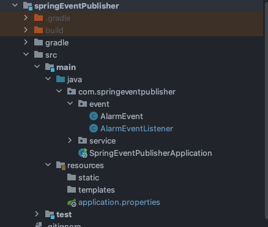
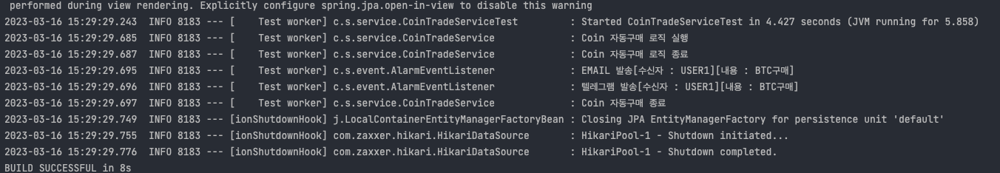
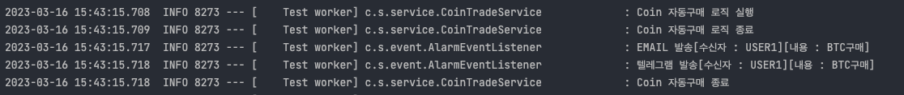
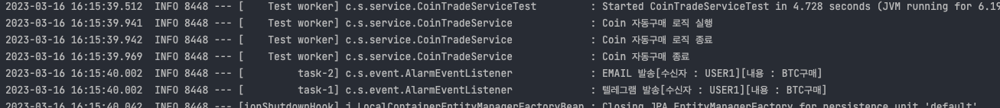

# 목적
Spring Event 사용방법

## 예제소스
### https://github.com/devHjlee/devHjBlog/tree/main/springEventPublisher 

## Spring Event
* 스프링이벤트란 스프링의 Bean 과 Bean 사이에 데이터를 전달하는 방법   
* 일반적으로 DI 를 통해 이루어진다 A Class 에서 B Class 에 대한 의존성을 주입받아 A Class 에서 B Class Method 를 호출하여 본인의 클래스에서 사용   
* 이벤트는 A Class 에서 ApplicationContext 로 넘겨주고 이를 Listener 에서 받아 처리.   
* 이벤트에는 발생시키는 Publisher 와 받는 Listener 이 있고 이벤트에서 데이터를 담는 이벤트 모델로 이루어져 있다.
* 직접적인 결합이 없기 때문에 로직의 흐름을 파악하기 쉽지 않다는 단점이 생길 수 도 있다.
* 스프링 이벤트는 언제 사용할까?
  * 서비스간의 결합도를 낮추고 싶고 메인 로직과 크게 상관이 없는 로직을 사용할 때(트랜잭션 분리)
  * 서브 로직이 에러가 나더라도 메인 로직은 정상적 완료 하고 싶을때이지만 이건 트랜잭션 설정에 따라서 다르게 할 수 있다.

## 개발환경
* IDE : IntelliJ
* Jdk : OpenJdk 11
* gradle
* spring boot : 2.7.9   

## 프로젝트 구조   


### 예제 소스
### 기본적인 구조
#### CoinTradeService

``` java    
@Slf4j
@Service
@RequiredArgsConstructor
@Transactional
public class CoinTradeService {
    final private ApplicationEventPublisher applicationEventPublisher;

    public void coinTrade(){
        log.info("Coin 자동구매 로직 실행");
        log.info("Coin 자동구매 로직 종료");
        //Event 발생
        applicationEventPublisher.publishEvent(new AlarmEvent("USER1","BTC구매"));
        log.info("Coin 자동구매 종료");
    }
}
```   

#### AlarmEvent(이벤트 모델)
* 이벤트 객체 Spring 4.2 이전까지는 ApplicationEvent를 상속받아야 했지만 Spring 4.2부터는 순수한 자바 객체(POJO)를 이벤트 객체로 사용할 수 있다.   

``` java    
@Getter
@Setter
@AllArgsConstructor
public class AlarmEvent {
    private String usrId;
    private String msg;
}
```   

#### AlarmEventListener
* Spring 4.2 이전까지는 ApplicationListener를 상속받아야 했지만 Spring 4.2부터는 @EventListener 애노테이션 기반으로 이벤트를 처리할 수 있다.   

``` java    
@Slf4j
@Component
public class AlarmEventListener {
    @EventListener
    public void sendTelegram(AlarmEvent event) {
        log.info(String.format("텔레그램 발송[수신자 : %s][내용 : %s]", event.getUsrId(), event.getMsg()));
    }

    @EventListener
    public void sendMail(AlarmEvent event) {
        log.info(String.format("EMAIL 발송[수신자 : %s][내용 : %s]", event.getUsrId(), event.getMsg()));
    }
}
```   
* 테스트 결과
  

``` java   
@Slf4j
@Component
public class AlarmEventListener {
    @EventListener
    @Order(2)
    public void sendTelegram(AlarmEvent event) {
        log.info(String.format("텔레그램 발송[수신자 : %s][내용 : %s]", event.getUsrId(), event.getMsg()));
    }

    @EventListener
    @Order(1)
    public void sendMail(AlarmEvent event) {
        log.info(String.format("EMAIL 발송[수신자 : %s][내용 : %s]", event.getUsrId(), event.getMsg()));
    }
}
```   
* Order 테스트 결과   

   


#### Test Code
```java   
@SpringBootTest
class CoinTradeServiceTest {
  @Autowired
  CoinTradeService coinTradeService;
  @Test
  void coinTrade() {
    coinTradeService.coinTrade();
  }
}
```   
### 비동기를 위한 @EnableAsync / @Async   
#### SpringEventPublisherApplication   
``` java    
@SpringBootApplication
@EnableAsync // 비동기 Event를 위한 설정
public class SpringEventPublisherApplication {

    public static void main(String[] args) {
        SpringApplication.run(SpringEventPublisherApplication.class, args);
    }

}
```   
#### AlarmEventListener 수정
``` java    
@Slf4j
@Component
public class AlarmEventListener {
    @EventListener
    @Async
    @Order(1)
    public void sendTelegram(AlarmEvent event) {
        log.info(String.format("텔레그램 발송[수신자 : %s][내용 : %s]", event.getUsrId(), event.getMsg()));
    }

    @EventListener
    @Async
    @Order(2)
    public void sendMail(AlarmEvent event) {
        log.info(String.format("EMAIL 발송[수신자 : %s][내용 : %s]", event.getUsrId(), event.getMsg()));
    }
}
```    
* 예를들어 이벤트인 메시지 발송이 오래 걸리는 상황에서 비동기 처리시 메인 로직은 이벤트의 응답을 기다리지 않아도 된다.   



### @TransactionalEventListener
* BEFORE_COMMIT
  AFTER_COMMIT
  AFTER_ROLLBACK
  AFTER_COMPLETION