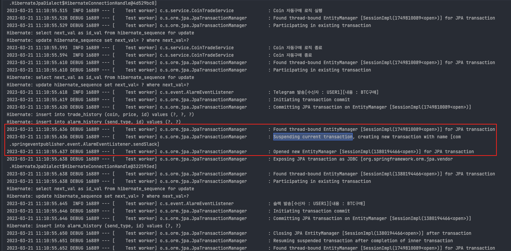
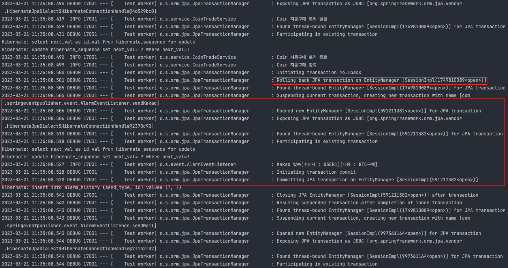
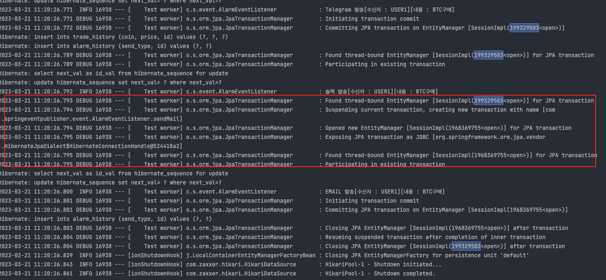

# 목적
Spring Event 사용방법

## 예제소스
### https://github.com/devHjlee/devHjBlog/tree/main/springEventPublisher 

## Spring Event
* 스프링이벤트란 스프링의 Bean 과 Bean 사이에 데이터를 전달하는 방법   
* 일반적으로 DI 를 통해 이루어진다 A Class 에서 B Class 에 대한 의존성을 주입받아 A Class 에서 B Class Method 를 호출하여 본인의 클래스에서 사용   
* 이벤트는 A Class 에서 ApplicationContext 로 넘겨주고 이를 Listener 에서 받아 처리.   
* 이벤트에는 발생시키는 Publisher 와 받는 Listener 이 있고 이벤트에서 데이터를 담는 이벤트 모델로 이루어져 있다.
* 직접적인 결합이 없기 때문에 로직의 흐름을 파악하기 쉽지 않다는 단점이 생길 수 도 있다.
* 스프링 이벤트는 언제 사용할까?
  * 서비스간의 결합도를 낮추고 싶고 메인 로직과 크게 상관이 없는 로직을 사용할 때(트랜잭션 분리)
  * 서브 로직이 에러가 나더라도 메인 로직은 정상적 완료 하고 싶을때이지만 이건 트랜잭션 설정에 따라서 다르게 할 수 있다.

## 개발환경
* IDE : IntelliJ
* Jdk : OpenJdk 11
* gradle
* spring boot : 2.7.9   

## 프로젝트 구조   


### 예제 소스
### 기본적인 구조
#### CoinTradeService

``` java    
@Slf4j
@Service
@RequiredArgsConstructor
@Transactional
public class CoinTradeService {
    final private ApplicationEventPublisher applicationEventPublisher;

    public void coinTrade(){
        log.info("Coin 자동구매 로직 실행");
        log.info("Coin 자동구매 로직 종료");
        //Event 발생
        applicationEventPublisher.publishEvent(new AlarmEvent("USER1","BTC구매"));
        log.info("Coin 자동구매 종료");
    }
}
```   

#### AlarmEvent(이벤트 모델)
* 이벤트 객체 Spring 4.2 이전까지는 ApplicationEvent를 상속받아야 했지만 Spring 4.2부터는 순수한 자바 객체(POJO)를 이벤트 객체로 사용할 수 있다.   

``` java    
@Getter
@Setter
@AllArgsConstructor
public class AlarmEvent {
    private String usrId;
    private String msg;
}
```   

#### AlarmEventListener
* Spring 4.2 이전까지는 ApplicationListener를 상속받아야 했지만 Spring 4.2부터는 @EventListener 애노테이션 기반으로 이벤트를 처리할 수 있다.   

``` java    
@Slf4j
@Component
public class AlarmEventListener {
    @EventListener
    public void sendTelegram(AlarmEvent event) {
        log.info(String.format("텔레그램 발송[수신자 : %s][내용 : %s]", event.getUsrId(), event.getMsg()));
    }

    @EventListener
    public void sendMail(AlarmEvent event) {
        log.info(String.format("EMAIL 발송[수신자 : %s][내용 : %s]", event.getUsrId(), event.getMsg()));
    }
}
```   
* 테스트 결과
  

``` java   
@Slf4j
@Component
public class AlarmEventListener {
    @EventListener
    @Order(2)
    public void sendTelegram(AlarmEvent event) {
        log.info(String.format("텔레그램 발송[수신자 : %s][내용 : %s]", event.getUsrId(), event.getMsg()));
    }

    @EventListener
    @Order(1)
    public void sendMail(AlarmEvent event) {
        log.info(String.format("EMAIL 발송[수신자 : %s][내용 : %s]", event.getUsrId(), event.getMsg()));
    }
}
```   
* Order 테스트 결과   

   


#### Test Code
```java   
@SpringBootTest
class CoinTradeServiceTest {
  @Autowired
  CoinTradeService coinTradeService;
  @Test
  void coinTrade() {
    coinTradeService.coinTrade();
  }
}
```   
### 비동기를 위한 @EnableAsync / @Async   
#### SpringEventPublisherApplication   
```java    
@SpringBootApplication
@EnableAsync // 비동기 Event를 위한 설정
public class SpringEventPublisherApplication {

    public static void main(String[] args) {
        SpringApplication.run(SpringEventPublisherApplication.class, args);
    }

}
```   
#### AlarmEventListener 수정
```java    
@Slf4j
@Component
public class AlarmEventListener {
    @EventListener
    @Async
    @Order(1)
    public void sendTelegram(AlarmEvent event) {
        log.info(String.format("텔레그램 발송[수신자 : %s][내용 : %s]", event.getUsrId(), event.getMsg()));
    }

    @EventListener
    @Async
    @Order(2)
    public void sendMail(AlarmEvent event) {
        log.info(String.format("EMAIL 발송[수신자 : %s][내용 : %s]", event.getUsrId(), event.getMsg()));
    }
}
```    
* 예를들어 이벤트인 메시지 발송이 오래 걸리는 상황에서 비동기 처리시 메인 로직은 이벤트의 응답을 기다리지 않아도 된다.   


### @TransactionalEventListener    
* 이벤트 발행자의 트랜잭션을 기준으로 이벤트 실행시점을 조절할때 사용   
  * BEFORE_COMMIT : 발행자의 트랜잭션이 커밋되기 직전에 이벤트를 발생   
  * AFTER_COMMIT : 발행자의 트랜잭션이 커밋된 후 이벤트 발생(Default)   
  * AFTER_ROLLBACK : 발행자의 트랜잭션이 롤백된 후 이벤트 발생   
  * AFTER_COMPLETION : 발행자의 트랜잭션 성공여부와 상관없이 끝나면 발생   


* 위에 사용하던 소스에서 CoinTradeService 와 AlarmEventListener 단순한 테스트를 위해 Save 로직추가    

```java    
@Service
@RequiredArgsConstructor
@Transactional
public class CoinTradeService {
    final private TradeHistoryRepository tradeHistoryRepository;
    final private ApplicationEventPublisher applicationEventPublisher;

    @Transactional
    public void coinTrade(){
        log.info("Coin 자동구매 로직 실행");
        TradeHistory th = new TradeHistory();
        th.setCoin("BTC");
        th.setPrice(10000L);
        tradeHistoryRepository.save(th);
        log.info("Coin 자동구매 로직 종료");
        //Event 발생
        applicationEventPublisher.publishEvent(new AlarmEvent("USER1","BTC구매"));
        log.info("Coin 자동구매 종료");

        //throw new RuntimeException();
    }
}
```    

* 기존 사용하던 @EventListener 에서 @TransactionEventListener 로 변경하고 이벤트(카카오,슬랙) 추가   

```java    
@Slf4j
@Component
@RequiredArgsConstructor
public class AlarmEventListener {
    private final AlarmHistoryRepository alarmHistoryRepository;

    @TransactionalEventListener(phase = TransactionPhase.AFTER_COMMIT)
    @Transactional(Transactional.TxType.REQUIRES_NEW)
    public void sendSlack(AlarmEvent event) {
        AlarmHistory ah = new AlarmHistory();
        ah.setSendType("Slack");
        alarmHistoryRepository.save(ah);
        log.info(String.format("슬랙 발송[수신자 : %s][내용 : %s]", event.getUsrId(), event.getMsg()));
        //throw new RuntimeException();
    }

    @TransactionalEventListener(phase = TransactionPhase.BEFORE_COMMIT)
    public void sendTelegram(AlarmEvent event) {
        AlarmHistory ah = new AlarmHistory();
        ah.setSendType("Telegram");
        alarmHistoryRepository.save(ah);
        log.info(String.format("Telegram 발송[수신자 : %s][내용 : %s]", event.getUsrId(), event.getMsg()));
    }

    @TransactionalEventListener(phase = TransactionPhase.AFTER_ROLLBACK)
    @Transactional(Transactional.TxType.REQUIRES_NEW)
    public void sendKakao(AlarmEvent event) {
        AlarmHistory ah = new AlarmHistory();
        ah.setSendType("Kakao");
        alarmHistoryRepository.save(ah);
        log.info(String.format("Kakao 발송[수신자 : %s][내용 : %s]", event.getUsrId(), event.getMsg()));
    }

    @TransactionalEventListener(phase = TransactionPhase.AFTER_COMPLETION)
    @Transactional(Transactional.TxType.REQUIRES_NEW)
    public void sendMail(AlarmEvent event) {
        AlarmHistory ah = new AlarmHistory();
        ah.setSendType("Email");
        alarmHistoryRepository.save(ah);
        log.info(String.format("EMAIL 발송[수신자 : %s][내용 : %s]", event.getUsrId(), event.getMsg()));
    }
}
```   

예시 : 정상적인 흐름일때에는 아래와 같다.   
* 위에 소스에서 텔레그램은 BEFORE_COMMIT 으로 선언되어 있어서 발행자와 같은 트랜잭션으로 묶인다.   
* 슬랙은 AFTER_COMMIT 으로 선언되어 있고 발행자의 트랜잭션이 커밋된 후 REQUIRES_NEW 를 통해 새 트랜잭션을 생성하고 Insert를 진행한다.   
* 이메일은 AFTER_COMPLETION이므로 발행자의 트랜잭션 커밋 후 성공여부와 상관없이 REQUIRES_NEW 를 통해 새 트랜잭션을 생성하고 Insert를 진행한다.   
* 카카오는 AFTER_ROLLBACK 으로 발행자의 트랜잭션이 롤백될 때에만 실행되게 설정했다.   
     
      
예시 : 발행자쪽 RuntimeException 발생시는 아래와 같다.
* 텔레그램은 발행자와 같은 트랜잭션에 있으므로 롤백
* 슬랙은 발행자의 롤백으로 인해 실행이 되지 않는다.
* 카카오는 발행자의 롤백으로 인해 실행된다.
* 이메일은 발행자의 트랜잭션 커밋,롤백 후 진행되므로 실행된다.
     
### @Transactional(Transactional.TxType.REQUIRES_NEW)   
예시 : 정상적인 흐름이나 슬랙이벤트에 REQUIRES_NEW 주석처리   
   

## Spring Event를 통해 위와 같이 비동기 처리를하거나 메인로직과 이벤트의 트랜잭션을 묶어 처리하거나 분리하여 처리할 수 있다.

### 참고자료
https://www.baeldung.com/spring-events    
https://velog.io/@znftm97/%EC%9D%B4%EB%B2%A4%ED%8A%B8-%EA%B8%B0%EB%B0%98-%EC%84%9C%EB%B9%84%EC%8A%A4%EA%B0%84-%EA%B0%95%EA%B2%B0%ED%95%A9-%EB%AC%B8%EC%A0%9C-%ED%95%B4%EA%B2%B0%ED%95%98%EA%B8%B0-ApplicationEventPublisher#span-stylecolor0b6e994-transactionaleventlistener-%EC%82%AC%EC%9A%A9%ED%95%98%EA%B8%B0span