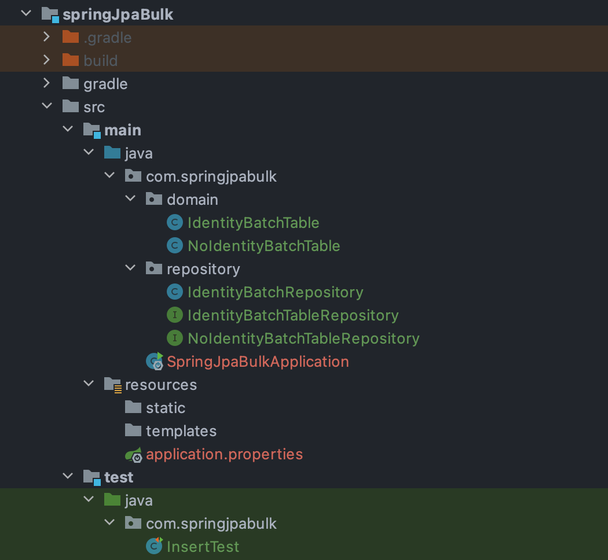
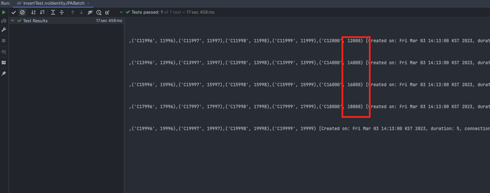
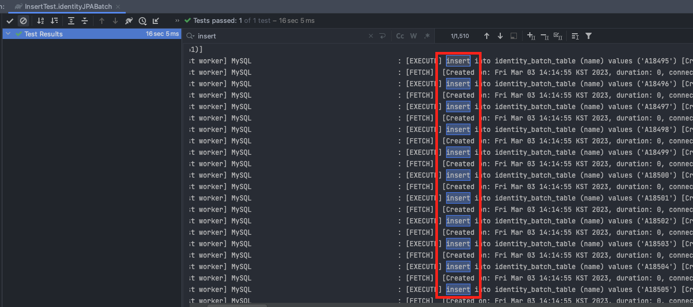
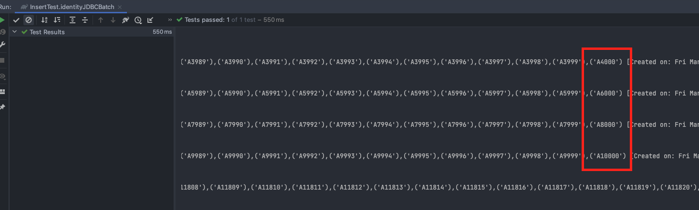

# 목적
JPA를 통해 개발할시 대용량 Insert 방법 구현
1. JPA Batch
2. JDBC Batch

## 예제소스
### https://github.com/devHjlee/devHjBlog/tree/main/springJpaBulk 

## Enity ID 전략에따라 구현하는 방법
  * ID 직접할당 : JPA, JDBC Batch
  * IDENTITY : JDBC Batch
    * Hibernate 에서는 IDENTITY 전략에 대해서는 Batch Insert를 비활성화시켜놨는데 새로 할당할 Key에 대해 미리 알수 없기 때문이다.
  * SEQUENCE : 데이터베이스 시퀀스를 사용해 식별자를 조회해오고 조회된 식별자를 엔티티에 할당하는방법(Mysql 불가능) JPA, JDBC Batch
  * TABLE : 키생성용 테이블을 통해 시퀀스전략을 흉내내는 전략 JPA, JDBC Batch

## 개발환경
* IDE : IntelliJ
* Jdk : OpenJdk 1.8
* DB : Mysql 8.0
* gradle
* spring boot : 2.7.8
  - spring-boot-starter-data-jpa  
  - mysql-connector-j


## 프로젝트 구조


### 예제 소스
#### IdentityBatchTable 
* IDENTITY 전략
``` java
@Entity
@Getter
@Builder
@NoArgsConstructor(access = AccessLevel.PROTECTED)
@AllArgsConstructor(access = AccessLevel.PRIVATE)
public class IdentityBatchTable {
    @Id
    @GeneratedValue(strategy = GenerationType.IDENTITY)
    private long id;
    @Column
    private String name;

}
```

#### NoIdentityBatchTable
* 기본ID 전략
``` java
@Entity
@Getter
@NoArgsConstructor(access = AccessLevel.PROTECTED)
public class NoIdentityBatchTable {
    @Id
    long id;
    @Column
    String name;

    @Builder
    public NoIdentityBatchTable(long id, String name){
        this.id = id;
        this.name = name;
    }
}
```

#### IdentityBatchRepository
* IDENTITY 전략을 사용한 IdentityBatchTable 을 bulkInsert 하기위해 JDBCTemplate 에서 제공해주는 BatchUpdate 구현 클래스
``` java
@Repository
@RequiredArgsConstructor
public class IdentityBatchRepository {

    private final JdbcTemplate jdbcTemplate;

    @Transactional
    public void saveAll(List<IdentityBatchTable> identityBatchTables) {
        String sql = "INSERT INTO identity_batch_table (name) " +
                "VALUES (?)";
        jdbcTemplate.batchUpdate(sql,
                identityBatchTables,
                2000,
                (PreparedStatement ps, IdentityBatchTable identityBatchTable) -> {
                    ps.setString(1, identityBatchTable.getName());
                });
    }

}
```

#### Test Code
```java
public class InsertTest {
    @Autowired
    NoIdentityBatchTableRepository noIdentityBatchTableRepository;
    @Autowired
    IdentityBatchTableRepository identityBatchTableRepository;
    @Autowired
    IdentityBatchRepository identityBatchRepository;

    @Test
    public void noIdentityJPABatch(){
        List<NoIdentityBatchTable> noIdentityBatchTables = new ArrayList<NoIdentityBatchTable>();
        for(int i = 1; i < 20000; i++){
            noIdentityBatchTables.add(NoIdentityBatchTable.builder().id(i).name("C"+i).build());
        }
        noIdentityBatchTableRepository.saveAll(noIdentityBatchTables);
    }
    @Test
    public void identityJPABatch(){
        List<IdentityBatchTable> identityBatchTables = new ArrayList<>();
        for(int i = 1; i < 20000; i++){
            IdentityBatchTable identityBatchTable = IdentityBatchTable.builder().name("A"+i).build();
            identityBatchTables.add(identityBatchTable);
        }
        identityBatchTableRepository.saveAll(identityBatchTables);
    }

    @Test
    public void identityJDBCBatch(){
        List<IdentityBatchTable> identityBatchTables = new ArrayList<>();
        for(int i = 1; i < 20000; i++){
            IdentityBatchTable identityBatchTable = IdentityBatchTable.builder().name("A"+i).build();
            identityBatchTables.add(identityBatchTable);
        }
        identityBatchRepository.saveAll(identityBatchTables);
    }

}
```
#### Mysql 관련 bulk Insert를 위한 application.properties 추가설정

spring.jpa.properties.hibernate.jdbc.batch_size=2000
* bulkInsert시 해당 사이즈로 끊어서 Insert
spring.datasource.url=jdbc:mysql://localhost:3306/jpa?useSSL=false&allowPublicKeyRetrieval=true&rewriteBatchedStatements=true&profileSQL=true&logger=Slf4JLogger&maxQuerySizeToLog=999999
* rewriteBatchedStatements=true : mysql 에서 bulk Insert를위한 필수 설정
* profileSQL= ture : Driver에 전송하는 쿼리를 출력
* logger=Slf4JLogger : Driver에서 쿼리 출력시 사용할 로거를 설정
* maxQuerySizeToLog=999999 : 출력할 쿼리 길이

### 테스트 3개 케이스 모두 Batch Size 2000으로 진행
* noIdentityJPABatch()
  
  * 17초...
* identityJPABatch()
  
  * 16초...
* identityJDBCBatch()
  
  * 0.5초

# 2만건에 대해서 이정도 시간차이가 발생하는걸보니 JPA를 사용한다고해서 JPA만 쓰면 안된다는걸 느끼게 되네...


