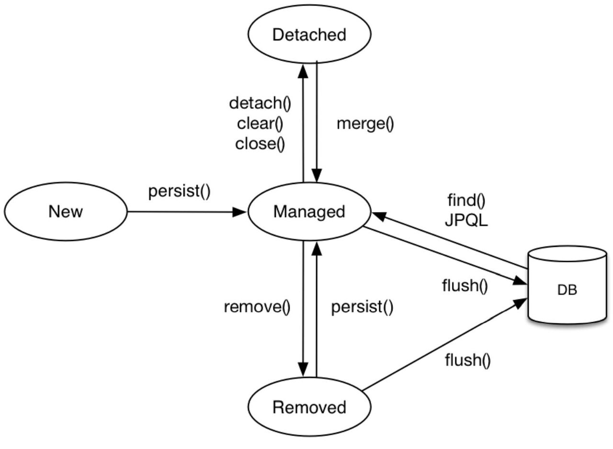
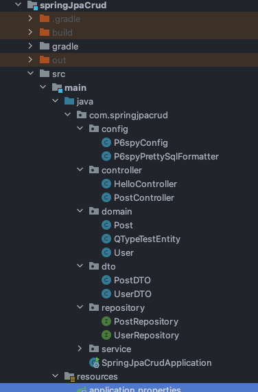
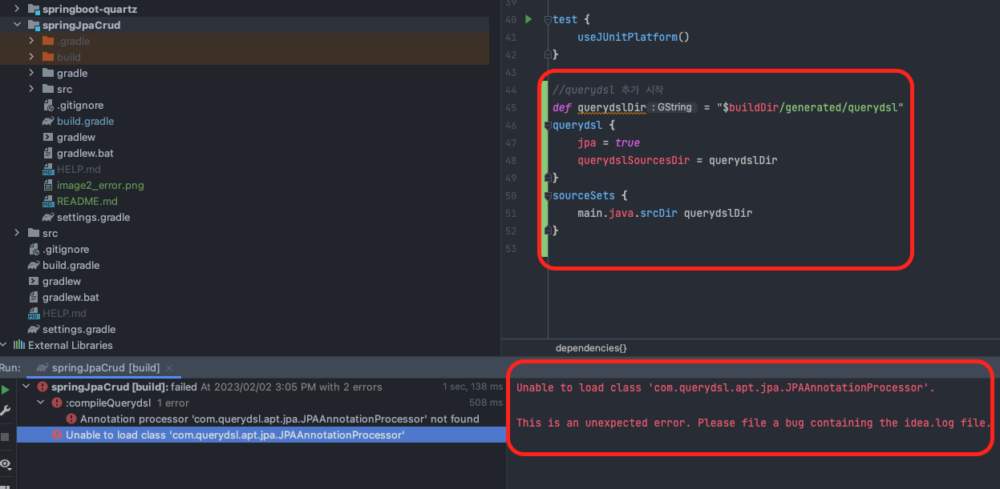
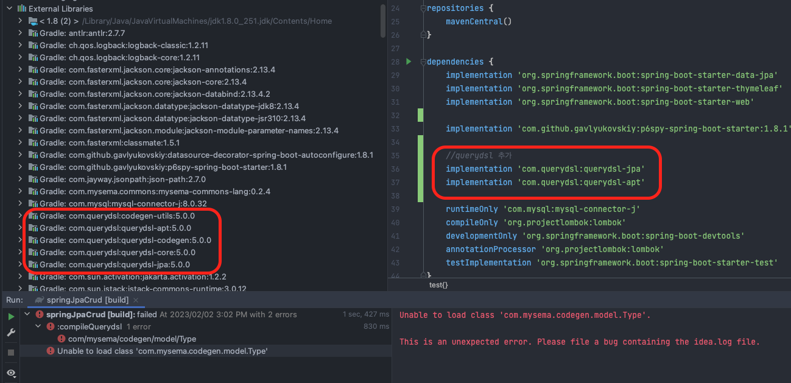
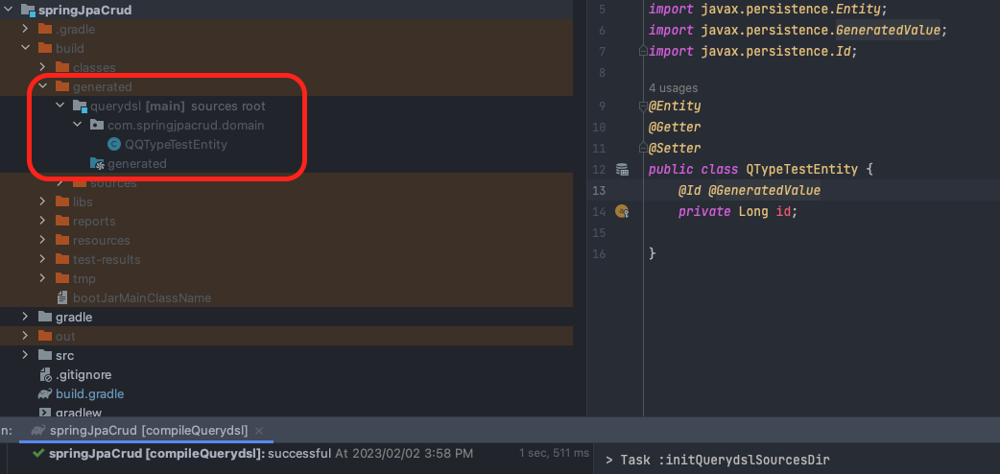
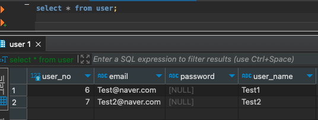
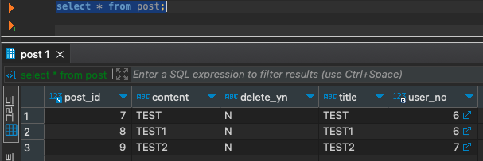
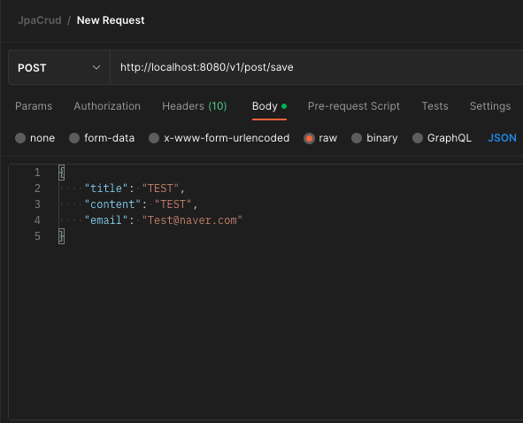
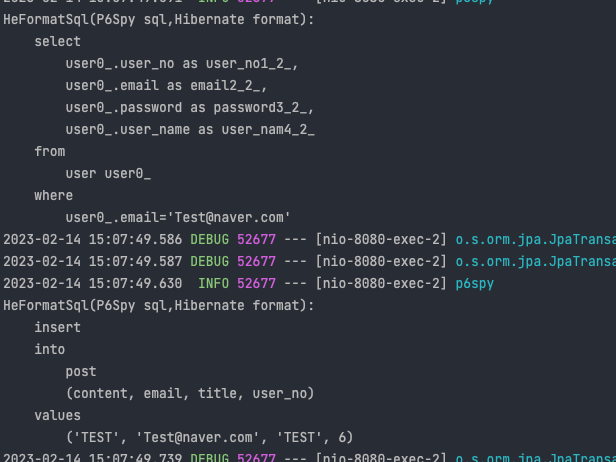

# 목적
1. 신규 프로젝트에서 사용 되었던 JPA, QueryDsl 을 정리
2. Spring Data Jpa 로 간단한 게시판 구현을 통해 정리
3. User, Post Entity 에서 Fetch LAZY, EAGER 변경해가면서 이해
4. QueryDsl 로 동적쿼리 작성

## 예제소스
###https://github.com/devHjlee/devHjBlog/tree/main/springJpaCrud  

## ORM ??
ORM(Object-Relational Mapping)은 객체와 관계형 데이터베이스를 매핑하며 ORM 프레임워크는 객체와 테이블을 매핑하여 패러다임 불일치 문제를 개발자 대신 해결해준다.
하이버네이트(hibernate.org)라는 오픈소스 ORM 프레임워크가 등장하면서 하이버네이트를 기반으로 새로운 자바 ORM 기술 표준이 만들어졌다.
## JPA 란?
JPA(Java Persistence API)는 JAVA 진영의 ORM(Object Relational Mapping) 기술 표준이다.즉, ORM을 사용하기 위한 인터페이스를 모아둔 것이라 볼 수 있다.  
ORM 에 대한 자바 API 규격이며 Hibernate, OpenJPA 등이 JPA 를 구현한 구현체이며 Application 과 JDBC 사이에서 동작한다.  
개발자가 직접 JDBC API를 사용하지 않고 JPA 내부 JDBC API 를 사용하여 SQL 을 호출하고 DataBase를 간적접으로 조작한다.

* Persistence Context 영속성 컨텍스트
    * Entity 를 영구저장하는 환경이라는 뜻
    * Application 과 DB 사이에서 객체를 보관하는 역할
    * Application 은 EntityManagerFactory을 통해 DB에 접근하는 트랜잭션이 생길때마다 EntityManager를 생성하여 영속성 컨텍스트에 접근
    * 동일성 보장
      * 하나의 EntityManager에서 가져온 Entity의 동일성을 보장한다.
    * transactional write-behind 쓰기지연
      * 한 트랜잭션 내에서 발생하는 insert update delete 에 대해 쓰기지연 SQL 저장소에 저장된 후 트랜잭션 종료시점에 한번에 실행한다.
    * DirtyChecking 변경감지
      * 엔티티의 수정이 일어나도 개발자는 영속성 컨텍스트에 따로 알려주지 않아도 영속성 컨텍스트가 알아서 변경 사항을 체크해준다.
      * 1차 캐시에 entity를 저장할때 스냅샷 필드도 따로 저장하여 commit이나 flush를 할 때 해당 entity와 스냅샷을 비교하여 변경사항이 있으면 알아서 UPDATE SQL을 만들어서 DB에 전송한다.
    * 1차캐시
      * 1차 캐시는 ID를 key,Entity 를 값으로하는 Map 형식으로 구성되어있다. 
      * 데이터 조회 시 1차 캐시에 데이터가 존재하는 경우 DB에 SELECT 쿼리를 보내는 것이 아니라 1차 캐시에서 데이터를 가져온다. 
      * 1차 캐시에 존재하지 않는 데이터를 조회하는 경우에는 DB에서 SELECT 쿼리를 보내 조회하고 1차 캐시에 저장한 후 리턴한다.
* Entity Manger
  * 영속성 컨텍스내에서 Entity를 관리
* Entity Life Cycle
  
  * 비영속(new/transist)
    * Entity 객체를 생성한 상태
  * 영속(managed)
    * EntityManager 의 persist(Entity)를 통해 영속성 컨택스트에 넣어진 상태
  * 준영속(detached)
    * 영속성 컨택스트에 저장되었다가 분리된 상태
    * detach(),clear(),close()
    * 식별자가 존재하며 merge()로 다시 영속성 상태가능
    * 1차캐시,쓰기지연,변경감지,지연로딩을 포함한 영속성 컨택스트가 제공하는 기능에대해 동작 하지 않는다.
  * 삭제(remove)
    * 영속성 컨택스트와 DB에서 해당 Entity를 삭제한 상태

## 개발환경
* IDE : IntelliJ
* Jdk : OpenJdk 1.8
* DB : Mysql 8.0
* gradle
* spring boot : 2.7.8
  - spring-boot-starter-data-jpa
  - com.querydsl jpa, apt
  - mysql-connector-j


## 프로젝트 구조


### 1. JPA, QueryDsl 설정
#### 1) build.gradle
* JPA 의존성 추가
* querydsl 플러그인 및 의존성 추가

```properties
buildscript {
  ext {
    queryDslVersion = "5.0.0"
  }
}

plugins {
  id 'java'
  id 'org.springframework.boot' version '2.7.8'
  id 'io.spring.dependency-management' version '1.0.15.RELEASE'
  id 'com.ewerk.gradle.plugins.querydsl' version '1.0.10'
}

group = 'com.springDataJpaCrud'
version = '0.0.1-SNAPSHOT'
sourceCompatibility = '1.8'

configurations {
  compileOnly {
    extendsFrom annotationProcessor
  }
}

repositories {
  mavenCentral()
}

dependencies {
  implementation 'org.springframework.boot:spring-boot-starter-data-jpa'
  implementation 'org.springframework.boot:spring-boot-starter-thymeleaf'
  implementation 'org.springframework.boot:spring-boot-starter-web'

  implementation 'com.github.gavlyukovskiy:p6spy-spring-boot-starter:1.8.1'

  //querydsl 추가
  implementation "com.querydsl:querydsl-jpa:${queryDslVersion}"
  implementation "com.querydsl:querydsl-apt:${queryDslVersion}"

  runtimeOnly 'com.mysql:mysql-connector-j'
  compileOnly 'org.projectlombok:lombok'
  developmentOnly 'org.springframework.boot:spring-boot-devtools'
  annotationProcessor 'org.projectlombok:lombok'
  testImplementation 'org.springframework.boot:spring-boot-starter-test'
}

test {
  useJUnitPlatform()
}

//querydsl 추가 시작
def querydslDir = "$buildDir/generated/querydsl"

querydsl {
  jpa = true
  querydslSourcesDir = querydslDir
}
sourceSets {
  main.java.srcDir querydslDir
}
compileQuerydsl{
  options.annotationProcessorPath = configurations.querydsl
}

configurations {
  compileOnly {
    extendsFrom annotationProcessor
  }
  querydsl.extendsFrom compileClasspath
}
```

* Unable to load class 'com.querydsl.apt.jpa.JPAAnnotationProcessor'
  * http://honeymon.io/tech/2020/07/09/gradle-annotation-processor-with-querydsl.html
```properties
    configurations {
      compileOnly {
        extendsFrom annotationProcessor
      }
      querydsl.extendsFrom compileClasspath
    }
```

* Unable to load class 'com.mysema.codegen.model.Type'
  * 최초 설정 시 버전을 명시 하지 않았을때 5.0.0 버전으로 되는걸 확인 했으나 위에 오류가 발생하여 버전을 명시하여 수정
```properties
    // 변경전
    implementation 'com.querydsl:querydsl-jpa'
    implementation 'com.querydsl:querydsl-apt'
    // 변경 후
    // 버전 명시 추가
    buildscript {
        ext {
        queryDslVersion = "5.0.0"
        }
    }
    //dependency 버전 명시
    implementation "com.querydsl:querydsl-jpa:${queryDslVersion}"
    implementation "com.querydsl:querydsl-apt:${queryDslVersion}"
 ```


#### 2) Q타입 확인용 Test Entity, Test Code 생성
* Gradle console : ./gradlew clean comlieQuerydsl

``` java
  @Entity
  @Getter
  @Setter
  public class QTypeTestEntity {
      @Id @GeneratedValue
      private Long id;
  
  }
```


``` java
    @Test
    public void testQueryDsl() {
        QTypeTestEntity qType = new QTypeTestEntity();
        em.persist(qType);

        JPAQueryFactory query = new JPAQueryFactory(em);
        QQTypeTestEntity qTyeTest = QQTypeTestEntity.qTypeTestEntity;

        QTypeTestEntity result = query.selectFrom(qTyeTest)
                .fetchOne();

        assertThat(result).isEqualTo(qType);
        assertThat(result.getId()).isEqualTo(qType.getId());
    }
```  

### 2. Spring Data JPA 로 Entity, Service, Repository, Controller 구현

#### 1) Post, User Entity
  * @NoArgsConstructor(access = AccessLevel.PROTECTED)
    * 기본생성자의 접근 제어를 PROTECTED 설정함으로써 무분별한 객체 생성을 막음 (ex : User user = new User)
  * @Setter 지양(절대 사용금지는 아니다)
    * Setter 는 그 의도 파악과 객체를 변경 할 수 있는 상태가 되어 안전성을 보장받기 힘들다.
    * JPA 에서 Setter는 곧 Update 쿼리를 의미하기에 변경이 필요하면 의미있는 메소드를 생성해서 변경하는것이 좋다.
  * (User) 1:N (Post) 양방향으로 Fetch LAZY, EAGER 차이점
    * 사용자 한명이 여러 글을 작성 할 수 있다는 가정하에 User Entity : OneToMany LAZY, Post Entity : ManyToOne EAGER 로 설정
  * 테스트를 위한 User, Post Table 의 데이터




  * 테스트를 위한 ManyToOne 설정  

```java
  @Entity
  @Getter
  @NoArgsConstructor(access = AccessLevel.PROTECTED)
  public class User {
    //... 생략
    @OneToMany(mappedBy = "user") //default : LAZY
    private List<Post> posts = new ArrayList<>();

  }

  @Entity
  @Getter
  @NoArgsConstructor(access = AccessLevel.PROTECTED)
  public class Post {
    //... 생략
    @ManyToOne(fetch = FetchType.EAGER) //default : EAGER
    @JoinColumn(name = "user_no")
    private User user;
    //... 생략
    /* 비지니스로직 */
    /* 게시글 수정 */
    public void updatePost(String title, String content) {
      this.title = title;
      this.content = content;
    }

  }
```  

* 테스트 코드

``` java
    @Test
    void find(){
        System.out.println("Post Find STATR");
        Post post = em.find(Post.class,7L); //1. 설명
        System.out.println("Post Find END");

        System.out.println("===================================");

        System.out.println("USER Find START");
        System.out.println(post.getUser().getUserName()); //2. 설명
        System.out.println("USER Find END");

        System.out.println("===================================");
        System.out.println("USER.POSTS Find START");
        System.out.println(post.getUser().getPosts().get(0).getTitle()); //3. 설명
        System.out.println("USER.POSTS Find END");

    }
 
```

* 테스트 코드 실행 로그 설명

``` java
HeFormatSql(P6Spy sql,Hibernate format): //1. 설명
select
post0_.post_id as post_id1_0_0_,
post0_.content as content2_0_0_,
post0_.delete_yn as delete_y3_0_0_,
post0_.title as title4_0_0_,
post0_.user_no as user_no5_0_0_,
user1_.user_no as user_no1_2_1_,
user1_.email as email2_2_1_,
user1_.password as password3_2_1_,
user1_.user_name as user_nam4_2_1_
from
post post0_
left outer join
user user1_
on post0_.user_no=user1_.user_no
where
post0_.post_id=7
Post Find END
===================================
USER Find START
Test1 //2. 설명
USER Find END
===================================
USER.POSTS Find START

HeFormatSql(P6Spy sql,Hibernate format): //3. 설명
select
posts0_.user_no as user_no5_0_0_,
posts0_.post_id as post_id1_0_0_,
posts0_.post_id as post_id1_0_1_,
posts0_.content as content2_0_1_,
posts0_.delete_yn as delete_y3_0_1_,
posts0_.title as title4_0_1_,
posts0_.user_no as user_no5_0_1_
from
post posts0_
where
posts0_.user_no=6
TEST
USER.POSTS Find END
```
1. Post Entity에서 User를 ManyToOne Fetch EAGER(즉시로딩) 설정시에는 User 와 조인(user_no)을 걸어 쿼리를 실행하여 User Entity도 불러온다.
2. 1에서 User값도 이미 불러온 상태이므로 User에 대한 쿼리를 실행하지 않아도 값을 불러올 수 있다.
3. User Entity 에서는 Post를 OneToMany Fetch LAZY(지연로딩) 로 설정하였기에 posts 는 프록시 객체로 가져온 상태였지만 post.getUser().getPosts() 로 접근시 해당 쿼리를 호출하게 된다.

위에 코드에서는 find primaryKey를 통해 JPA에 의해 Join 되면서 게시글 하나의 값만 가져오게 해놨는데 게시글이 9천건 이라고 가정하고  
JPQL 을 통해 select p from POST p 쿼리를 진행하면 Post 안에 User가 비어있는것을 채우기 위해 User에 관한 쿼리가 9천번 실행될 것이다. 
이러한 N+1 문제는 LAZY 로 변경 후 JPQL fetch join 으로 해결 할 수도 있다.

다시 원래 소스로 돌아가서 게시글 테이블은 회원 테이블과 연관관계(ManyToOne)를 갖고 회원테이블은 연관관계없이 단방향으로 하였다.

* Entity
```java
    @Entity
    @Getter
    @NoArgsConstructor(access = AccessLevel.PROTECTED)
    public class User {
    
        @Id
        @GeneratedValue(strategy = GenerationType.IDENTITY)
        @Column(name = "user_no")
        private Long id;
    
        private String email;
        private String userName;
        private String password;
    
        @Builder
        public User(String email, String userName, String password){
            this.email = email;
            this.userName = userName;
            this.password = password;
        }
    }

    @Entity
    @Getter
    @NoArgsConstructor(access = AccessLevel.PROTECTED)
    public class Post {
    
        @Id
        @GeneratedValue(strategy = GenerationType.IDENTITY)
        @Column(name = "post_id")
        private Long id;
    
        @Column(nullable = false)
        private String title;
    
        @Column(nullable = false,columnDefinition = "TEXT")
        private String content;
    
        @ManyToOne(fetch = FetchType.LAZY)
        @JoinColumn(name = "user_no")
        private User user;
    
        @Builder
        public Post(String title, String content, User user){
            this.title = title;
            this.content = content;
            this.user = user;
        }
    
        /* 비지니스로직 */
        /* 게시글 수정 */
        public void updatePost(String title, String content) {
            this.title = title;
            this.content = content;
        }
    }
```

#### 2) Repository, Service
* Repository
```java
 public interface UserRepository extends JpaRepository<User,Long>{

    User findByEmail(String email);

    boolean existsByEmail(String email);

}

public interface PostRepository extends JpaRepository<Post,Long> {
    List<Post> findPostByTitleOrContent(String content, String title);
}
```

* Service

```java
@RequiredArgsConstructor
@Service
@Transactional
public class UserService {

    private final UserRepository userRepository;

    /* Spring Data Jpa 를 통한 기능 */
    /**
     * 전체 사용자 조회
     * @return List<User>
     */
    public List<UserDTO> findAll(){

        return userRepository.findAll().stream()
                .map(m->UserDTO.builder()
                        .userName(m.getUserName())
                        .email(m.getEmail())
                        .password(m.getPassword()) //@jsonignore Test
                        .build())
                .collect(Collectors.toList());
    }

    public User findByEmail(String email){
        return userRepository.findByEmail(email);
    }

    public boolean save(UserDTO userDTO){
        if(!userRepository.existsByEmail(userDTO.getEmail())){
            User user = userDTO.toEntity();
            userRepository.save(user);
            return true;
        }
        return false;
    }
}
```

```java
@RequiredArgsConstructor
@Service
@Transactional
public class PostService {
    private final PostRepository postRepository;
    private final UserRepository userRepository;

    /* Spring Data Jpa 를 통한 기능 */

    public List<PostDTO> findByTitleOrContent(String title, String content) {
        return postRepository.findPostByTitleOrContent(title, content).stream()
                .map(m-> PostDTO.builder()
                        .title(m.getTitle())
                        .content(m.getContent())
                        .build())
                .collect(Collectors.toList());
    }

    public PostDTO findPostById (Long id) {
        Post post = postRepository.findPostById(id);
        return PostDTO.builder()
                .title(post.getTitle())
                .content(post.getContent())
                .build();
    }

    public List<PostDTO> findAll() {
        return postRepository.findAll().stream()
                .map(m-> PostDTO.builder()
                        .id(m.getId())
                        .title(m.getTitle())
                        .content(m.getContent())
                        .email(m.getEmail())
                        .build())
                .collect(Collectors.toList());
    }

    public boolean save(PostDTO postDTO) {
        User user = userRepository.findByEmail(postDTO.getEmail());
        if(user != null){
            postDTO.setUser(user);
            postRepository.save(postDTO.toEntity());
            return true;
        }
        return false;
    }

    public boolean updatePost(PostDTO postDTO) {
        Post post = postRepository.findPostById(postDTO.getId());
        if(post != null) {
            post.updatePost(postDTO.getTitle(), postDTO.getContent());
        }
        return true;
    }
}
```
#### 3) Controller
* controller
```java
@RestController
@RequestMapping(value = "/v1/post")
@RequiredArgsConstructor
public class PostController {
    @PostMapping(value = "/save")
    public ResponseEntity<?> savePost(@RequestBody PostDTO postDto){

        return new ResponseEntity<>(postService.save(postDto), HttpStatus.OK);
    }
}
```

PostMan을 통한 Save 테스트 및 쿼리로그





## QueryDsl 이란?
정적타입을 이용하여 SQL 과 같은 쿼리를 생성할 수 있도록 제공하는 오픈소스(JPQL 을 만들어주는 builder 최종적으로는 JPQL 로 변환)
예시 : 학교 1:N 학급 1:N 학생 연관관계를 갖고있을때 JPA만을 통해 조회를 진행하게되면 학교에 해당하는 학생을 찾으려면 학교를 통해 학급을 조회하게되고 다시 학급을 통해 학생을 조회하기때문에 수만흔 select 쿼라가 발생할수도있다.
또한 연관관계가 없어도 join을 통해 쿼리를 작성 할 수 있고 DTO를 생성하여 원하는 레코드만 반환할 수 있다.

## JPQL QueryDsl 비교
JPQL
- JPQL 은 문자(String)이며, Type-Check가 불가능.
- 해당 로직 실행 전까지 작동여부 확인이 불가
- 파라미터 바인딩은 문자열로 입력하기에 런타임 시점(실행시점오류)   

QueryDSL
- 문자가 아닌 코드로 작성
- 파라미터바인딩 자동(sqlinjection에대해 안전)
- 컴파일 시점 문법 오류 발견이 가능
- 코드 자동 완성
- 동적쿼리 가능
- JPQL 단점 보완

## 사용시 주의점   
### 1차캐시 이슈
JPA 에서 findBy 는 영속성 컨텍스트를 먼저 조회한 후, 없으면 데이터베이스를 조회하며 식별자가 아니면 1차 캐시를 사용하지 않는다. 식별자가 아닌 값으로 조회했을 때, 중복된 값을 조회해버리면 상당히 복잡해지기 때문
JPQL 의 경우 데이터베이스를 먼저 조회한 후, 영속성 컨텍스트에 값이 들어있으면 버리고 없으면 저장.
QueryDsl 은 JPQL 로 변화되며 조회할 때, 영속성 컨텍스트를 먼저 조회하지 않고, 데이터베이스를 먼저 조회.
데이터베이스에서 조회해온 결과를 영속성 컨텍스트에 넣으려고하는데 이때 영속성 컨텍스트에 이미 해당 데이터가 있다면 데이터베이스를 통해 가져온 결과는 버린다.
이렇게 하는 이유는 영속성에도 값과, 데이터베이스에 읽어온 값이 충돌하며 이는 DIRTY READ 가 발생한는 것이며, (영속성 컨텍스트에 있는 값을 변경중일 수 있으니) 데이터베이스에서 조회한 값을 버림으로써 NON-REPEATABLE READ 발생 도 막는 것
그렇기에 JPA 내부에서 위와 같이 동작함으로 애플리케이션 레벨에서 REPEATABLE READ 레벨로 동작하게 되므로 이와같은 문제를 해결하기 위해서 데이터를 조회하기 전에 영속성 컨텍스트를 초기화하는 방법으로 해결이 가능하다.

### 동시성 문제
동시성 문제는 JPAQueryFactory를 생성할 때 제공하는 EntityManager(em)에 달려있다.
스프링 프레임워크는 여러 쓰레드에서 동시에 같은 EntityManager에 접근해도, 트랜잭션 마다 별도의 영속성 컨텍스트를 제공하기 때문에, 동시성 문제는 걱정하지 않아도 된다.

### 기존 예시 소스중 Post(게시글)를 Querydsl 관련 변경 
#### 1.Querydsl Config   

```java   
@Configuration
public class QuerydslConfig {

@PersistenceContext
private EntityManager entityManager;

@Bean
public JPAQueryFactory jpaQueryFactory(){
  return new JPAQueryFactory(entityManager);
}
}
```   

#### 2.Post Repository
* https://docs.spring.io/spring-data/jpa/docs/current/reference/html/#repositories.custom-implementations 
* PostRepositoryCustom,PostRepositoryImpl 추가   
    * QType 선언 방법
      * QPost p = new QPost("p");
      * QPost qpost = QPost.post;
      * import static com.springjpacrud.domain.QPost.post; >>>> 권장   

    * 결과 조회 메소드     
      * fetch() : 리스트 조회, 데이터 없으면 빈 리스트 반환      
      * fetchOne() : 단 건 조회    
      * 결과가 없으면 : null    
      * 결과가 둘 이상이면 : com.querydsl.core.NonUniqueResultException      
      * fetchFirst() : limit(1).fetchOne()    
      * fetchResults() : 페이징 정보 포함, total count 쿼리 추가 실행 -- deprecated   
      * fetchCount() : count 쿼리로 변경해서 count 수 조회 --  deprecated   
      실무에서 페이징 쿼리를 작성할 때, 데이터를 조회하는 쿼리는 여러 테이블을 조인해야 하지만, count 쿼리는 조인이 필요 없는 경우도 있다.  그런데 이렇게 자동화된 count 쿼리는 원본 쿼리와 같이 모두 조인을 해버리기 때문에 성능이 안나올 수 있다.   
      count 쿼리에 조인이 필요없는 성능 최적화가 필요하다면, count 전용 쿼리를 별도로 작성해야 한다.   

```java   
public interface PostRepositoryCustom {
    List<Post> getPosts();
    List<Post> getPostsFetchJoin();
    List<Post> getPostsNoRelation();
    List<PostUserDTO> getDto();
}

import static com.springjpacrud.domain.QPost.post;
import static com.springjpacrud.domain.QUser.user;

@RequiredArgsConstructor
public class PostRepositoryImpl implements PostRepositoryCustom {
    private final JPAQueryFactory jpaQueryFactory;

    private final JPAQueryFactory jpaQueryFactory;

    @Override
    public List<Post> getPosts() {
        return jpaQueryFactory
                .selectFrom(post)
                .join(post.user, user)
                .fetch();
    }

    @Override
    public List<Post> getPostsFetchJoin() {
        return jpaQueryFactory
                .selectFrom(post)
                .join(post.user, user)
                .fetchJoin()
                .fetch();
    }

    @Override
    public List<Post> getPostsNoRelation() {
        return jpaQueryFactory
                .selectFrom(post)
                .join(user).on(post.user.id.eq(user.id))
                .fetch();
    }

    @Override
    public List<PostUserDTO> getDto() {
        return jpaQueryFactory
                .select(new QPostUserDTO(post.title,post.content, user.email, user.userName))
                .from(post)
                .join(user).on(post.user.id.eq(user.id))
                .fetch();
    }
}

```    

* PostRepository 변경
   
```java   
public interface PostRepository extends JpaRepository<Post,Long>, PostRepositoryCustom {
    List<Post> findPostByTitleOrContent(String content, String title);
    Post findPostById(Long id);
}

```   

* Test   
```java   
    @Test
    void getPosts(){
        boolean loaded;
        //연관관계 Entity 조회
        //JpaRepository
        List<Post> posts = postRepository.findAll();
        loaded = emf.getPersistenceUnitUtil().isLoaded(posts.get(0).getUser());
        assertThat(false).isEqualTo(loaded);

        //join(1)
        List<Post> posts2 = postService.getPosts();
        loaded = emf.getPersistenceUnitUtil().isLoaded(posts2.get(0).getUser());
        assertThat(false).isEqualTo(loaded);

        posts2.get(0).getUser().toString();//(1.1)
        loaded = emf.getPersistenceUnitUtil().isLoaded(posts2.get(0).getUser());
        assertThat(true).isEqualTo(loaded);

        //FetchJoin(2)
        List<Post> posts3 = postService.getPostsFetchJoin();
        loaded = emf.getPersistenceUnitUtil().isLoaded(posts3.get(0).getUser());
        assertThat(true).isEqualTo(loaded);

        //연관관계 없을시 join on(3)
        List<Post> posts4 = postService.getPostsNoRelation();
        loaded = emf.getPersistenceUnitUtil().isLoaded(posts4.get(0).getUser());
        assertThat(true).isEqualTo(loaded);

        //@QueryProjection DTO(4)
        List<PostUserDTO> posts5 = postService.getDto();
        loaded = emf.getPersistenceUnitUtil().isLoaded(posts5.get(0).getUserName());
        assertThat(true).isEqualTo(loaded);
    }
```   

* (1) : 연관관계가 있는 엔티티와 Join을 하여 사용할 수 있고 연관관계에 따라 on이 붙는다.    
* (1.1) : 이때 Lazy로 설정 해놨기에 User는 Proxy 객체 상태에서 직접 접근시 데이터베이스를 통해 조회한다.     
```java   
select
post0_.post_id as post_id1_0_,
post0_.content as content2_0_,
post0_.email as email3_0_,
post0_.title as title4_0_,
post0_.user_no as user_no5_0_
from
post post0_
inner join
user user1_
on post0_.user_no=user1_.user_no   

select
    user0_.user_no as user_no1_2_0_,
    user0_.email as email2_2_0_,
    user0_.password as password3_2_0_,
    user0_.user_name as user_nam4_2_0_ 
from
    user user0_ 
where
    user0_.user_no=1   
```   
    
* (2) : fetchJoin 사용시 User를 프록시객체가 아닌 실제 객체로 가져온다.    
```java   
    select
        post0_.post_id as post_id1_0_0_,
        user1_.user_no as user_no1_2_1_,
        post0_.content as content2_0_0_,
        post0_.email as email3_0_0_,
        post0_.title as title4_0_0_,
        post0_.user_no as user_no5_0_0_,
        user1_.email as email2_2_1_,
        user1_.password as password3_2_1_,
        user1_.user_name as user_nam4_2_1_ 
    from
        post post0_ 
    inner join
        user user1_ 
            on post0_.user_no=user1_.user_no
```   
* (3) : Join on을 이용하여 연관관계가 없는 테이블과 Join하여 사용할 수 있다.   
```java   
    select
        post0_.post_id as post_id1_0_,
        post0_.content as content2_0_,
        post0_.email as email3_0_,
        post0_.title as title4_0_,
        post0_.user_no as user_no5_0_ 
    from
        post post0_ 
    inner join
        user user1_ 
            on (
                post0_.user_no=user1_.user_no
            )
```   
* (4) : QueryProjection 을 통해 QDTO 가 생성되고 리턴받을 수 있다.   
    * 컴파일러 타입을 체크할 수 있어 안전하지만 QueryDsl에 의존성이 심해진다. 귀찮다.
```java   
    select
        post0_.title as col_0_0_,
        post0_.content as col_1_0_,
        user1_.email as col_2_0_,
        user1_.user_name as col_3_0_ 
    from
        post post0_ 
    inner join
        user user1_ 
            on (
                post0_.user_no=user1_.user_no
            )
```   


