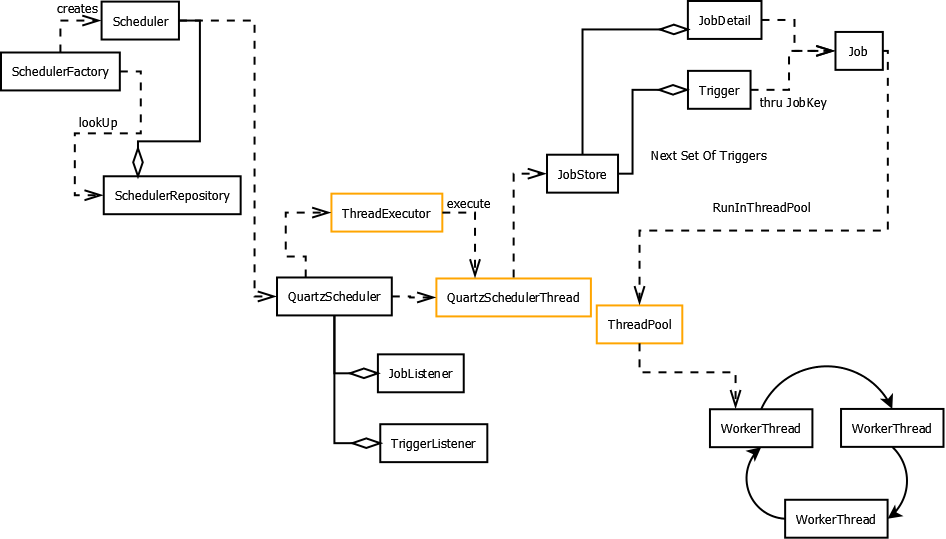
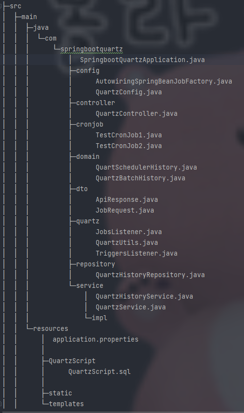
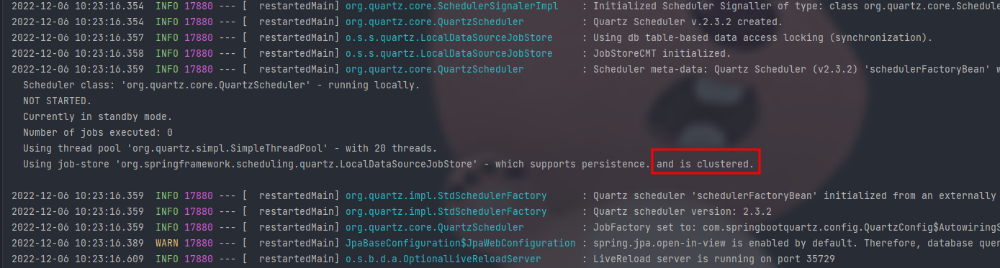
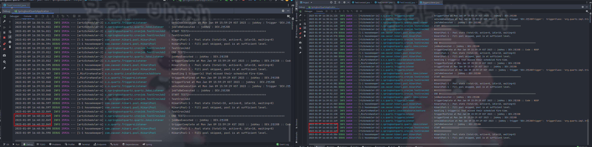
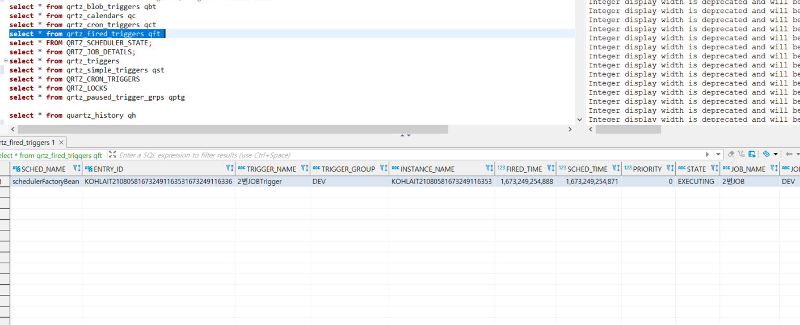
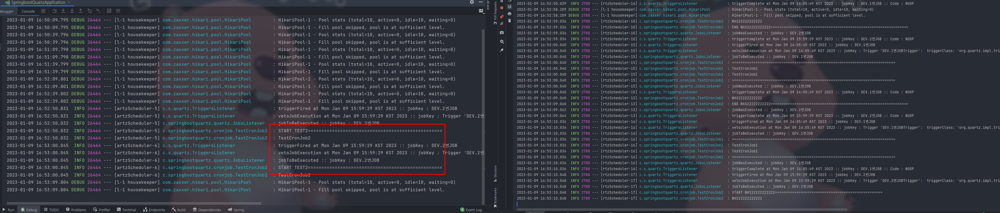
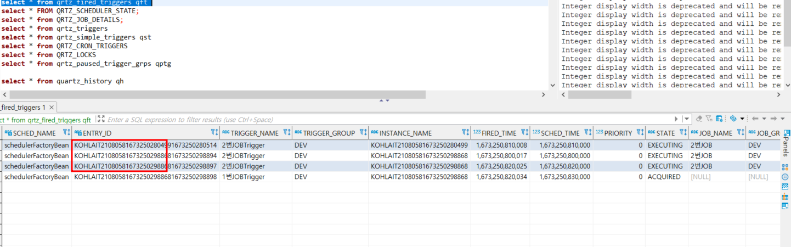

# 개요
* 스프링스케줄러+shedLock 로 이중화 기능 구현하였으나 스케줄에 대한 설정을 위해 Quartz 로 변경
* 구현 목록
  * DB Cluster 를 통한 이중화
  * CronTrigger 생성,수정,일시정지,재기동
  * 스케줄 변경 정보, 스케줄 수행 이력
  * Job 실패시 기존 등록된 수행시간에 맞춰 지정된 횟수만큼 수행 (횟수 초과시 중지)  

## 목차
  공식 홈페이지 : http://www.quartz-scheduler.org/

  [0.Quartz란?](#Quartz란?)

  [1.개발환경](#개발환경)

  [2.용어정리](#용어정리)

  [3.프로젝트 구조](#프로젝트구조)

  [4.소스 설명](#프로젝트내_주요_소스설명)

## Quartz란?
Job Scheduling 라이브러리 이며 자바로 개발되어 모든 자바 프로그램에서 사용 가능하고
간단한 interval형식이나 Cron 표현식 스케줄링 지원
* 장점
  * DB 기반의 클러스터 기능 제공
  * 시스템 Fail-over / Random 방식의 로드 분산처리 지원
  * In-memory Job scheduler 제공
  * 여러 기본 플러그인 제공
    * ShutdownHookPlugin – JVM 종료 이벤트 캐치
    * LoggingJobHistoryPlugin – Job 실행 로그 남기기

* 단점
  * Random 방식 클러스터링 기능이라 완벽한 로드 분산 안됨
  * 스케줄링 실행에 대한 히스토리 보관에 대한 개발 필요

* Quartz 흐름
  
  출처 : https://www.javarticles.com/2016/03/quartz-scheduler-model.html#prettyPhoto

## 개발환경
* Jdk : OpenJdk 1.8
* DB : Mysql 8.0
* spring boot : 2.7.6
  - spring-boot-starter-data-jpa
  - spring-boot-starter-quartz
  - mysql-connector-j

## 용어정리
* Job
  * 개발자는 수행해야 하는 실제 작업을 이 메서드에서 구현
  * Job 인터페이스의 excute 메소드를 trigger 에 의해 실행
  * Job excute vs QuartzJobBean executeInternal
    * https://stackoverflow.com/questions/66066744/spring-boot-starter-quartz-implements-job-vs-extends-quartzjobbean
* JobDetail
  * Job 을 실행시키기 위한 정보를 담고 있는 객체
  * Job 의 Name,Group JobDataMap 속성 등을 지정
  * Trigger 가 Job 을 수행할 때 JobDetail 기반으로 스케줄링
* Trigger
  * Job 을 실행시킬 스케줄링 조건 (반복 횟수, 시작시간) 등을 담고 있고 Scheduler 는 이 정보를 기반으로 Job 을 수행
  * Trigger 와 Job 연관관계
    * 1 = 1 : 하나의 Trigger 는 하나의 Job 을 반드시 지정
    * N = 1 : 여러 Trigger 가 하나의 Job 을 지정하여 다양한 시간에 스케줄
  * Trigger 종류
    * SimpleTrigger
    * CronTrigger
* JobStroe
  * Job, Trigger에 대한 정보를 저장하는 방식 설정(Memory,DB)
* Listener
  * JobListener : Job 실행 전후로 이벤트를 받을 수 있음
  * TriggerListener : Trigger 실행 전후로 이벤트를 받을 수 있음

## 프로젝트구조


## 프로젝트내_주요_소스설명
#### QuartzConfig
```java
@Configuration
public class QuartzConfig {

    //...생략
    @Bean
    public SchedulerFactoryBean schedulerFactoryBean(ApplicationContext applicationContext) {
        SchedulerFactoryBean schedulerFactoryBean = new SchedulerFactoryBean();

        AutowiringSpringBeanJobFactory jobFactory = new AutowiringSpringBeanJobFactory();
        jobFactory.setApplicationContext(applicationContext);
        schedulerFactoryBean.setJobFactory(jobFactory);

        schedulerFactoryBean.setApplicationContext(applicationContext);

        Properties properties = new Properties();
        properties.putAll(quartzProperties.getProperties());

        schedulerFactoryBean.setGlobalTriggerListeners(triggersListener);
        schedulerFactoryBean.setGlobalJobListeners(jobsListener);
        schedulerFactoryBean.setOverwriteExistingJobs(true);
        schedulerFactoryBean.setDataSource(dataSource);
        schedulerFactoryBean.setQuartzProperties(properties);
        schedulerFactoryBean.setWaitForJobsToCompleteOnShutdown(true);


        return schedulerFactoryBean;
    }
}
```
#### AutowiringSpringBeanJobFactory

```java
public class AutowiringSpringBeanJobFactory extends SpringBeanJobFactory implements ApplicationContextAware {
    private transient AutowireCapableBeanFactory beanFactory;

    @Override
    public void setApplicationContext(ApplicationContext applicationContext) throws BeansException {
        beanFactory = applicationContext.getAutowireCapableBeanFactory();
    }

    @Override
    protected Object createJobInstance(TriggerFiredBundle bundle) throws Exception {
        final Object job = super.createJobInstance(bundle);
        beanFactory.autowireBean(job);
        return job;
    }

}
```
* Quartz Job 에서 Spring bean 을 참조하기 위해 설정추가

#### quartz.properteis
```properties
#Quartz
spring.quartz.scheduler-name=QuartzScheduler
spring.quartz.properties.org.quartz.scheduler.instanceId=AUTO
spring.quartz.properties.org.quartz.threadPool.threadCount=20
spring.quartz.properties.org.quartz.threadPool.threadNamePrefix=QuartzScheduler
spring.quartz.properties.org.quartz.jobStore.tablePrefix=QRTZ_
spring.quartz.properties.org.quartz.jobStore.isClustered=true
spring.quartz.properties.org.quartz.jobStore.class=org.springframework.scheduling.quartz.LocalDataSourceJobStore
#spring.quartz.properties.org.quartz.jobStore.class=org.quartz.impl.jdbcjobstore.JobStoreTX
#spring.quartz.properties.org.quartz.jobStore.class=org.quartz.impl.jdbcjobstore.JobStoreCMT
spring.quartz.properties.org.quartz.jobStore.driverDelegateClass=org.quartz.impl.jdbcjobstore.StdJDBCDelegate
spring.quartz.properties.org.quartz.jobStore.useProperties=true
spring.quartz.properties.org.quartz.jobStore.misfireThreshold=60000
```
* jobStore.class
  * JobStoreTX : 트랜잭션을 제어하고 싶은 경우나, 서버 환경 없이 어플리케이션을 운영하려 할 때 사용된다.
  * JobStoreCMT : 어플리케이션 서버 환경 내에서 어플리케이션이 운영되며 컨테이너가 트랜잭션을 관리하도록 하고 싶은 경우 사용된다.
  * LocalDataSourceJobStore : JobStoreTX 사용시 dataSource null 오류 , 스프링에서 대체됨
    * https://github.com/ChamithKodikara/quartz-demo/issues/1
    * https://docs.spring.io/spring-framework/docs/current/javadoc-api/org/springframework/scheduling/quartz/LocalDataSourceJobStore.html

* DB Cluster 확인
  


#### JobListener
```java
@Component
@RequiredArgsConstructor
public class JobsListener implements JobListener {

  private final QuartzBatchLogService quartzBatchLogService;

  @Override
  public String getName() {
    return "globalJob";
  }

  /**
   * Job 수행 전
   * @param context
   */
  @Override
  public void jobToBeExecuted(JobExecutionContext context) {
    JobKey jobKey = context.getJobDetail().getKey();
    log.info("jobToBeExecuted :: jobKey : {}", jobKey);
  }

  /**
   * Job 중단된 상태
   * @param context
   */
  @Override
  public void jobExecutionVetoed(JobExecutionContext context) {
    JobKey jobKey = context.getJobDetail().getKey();
    log.info("jobExecutionVetoed :: jobKey : {}", jobKey);
  }

  /**
   * Job 수행 완료 후
   * retry N : Job Exception 발생 시 해당 Trigger,Job Pause
   * retry Y : Job Exception 발생 시 등록된 기존 Cron Expression 시간에 맞춰 재시도 / 총 3번 실패 시 해당 Trigger 중지
   * @param context
   * @param jobException
   */
  @Override
  public void jobWasExecuted(JobExecutionContext context, JobExecutionException jobException) {

    final int maxCnt = 3;

    int failCnt = context.getTrigger().getJobDataMap().getIntValue("failCnt");
    String stop = (String) context.getTrigger().getJobDataMap().get("stop");
    String retry = (String) context.getTrigger().getJobDataMap().get("retry");
    String schedName = "";
    JobKey jobKey = context.getJobDetail().getKey();
    JobDataMap jobDataMap = context.getTrigger().getJobDataMap();

    log.info("jobWasExecuted :: jobKey : {}", jobKey);
    try {
      schedName = context.getScheduler().getSchedulerName();
      if(jobException != null){
        log.debug("Exception : {}",jobException.getMessage());

        if("N".equals(retry)){
          //context.getScheduler().pauseJob(jobKey);
          jobException.setUnscheduleAllTriggers(true);
        }else {
          ++failCnt;

          if (maxCnt == failCnt) {
            jobDataMap.put("stop", "Y");
          } else {
            jobDataMap.put("failCnt", String.valueOf(failCnt));
          }
          if (("N").equals(stop)) {

            CronTrigger cronTrigger = (CronTrigger) context.getTrigger();
            Trigger newTrigger = TriggerBuilder
                    .newTrigger()
                    .startAt(new Date(System.currentTimeMillis() + 60000)) //reschedule 진행시 즉시 수행되는것을 방지하기 위해
                    .withIdentity(context.getTrigger().getKey())
                    //.withSchedule(CronScheduleBuilder.cronSchedule("*****"))
                    .withSchedule(cronTrigger.getScheduleBuilder())
                    .usingJobData(jobDataMap) // 실패 횟수,정지여부를 Trigger JobDataMap에 추가
                    .build();

            context.getScheduler().rescheduleJob(context.getTrigger().getKey(), newTrigger);
            //정해진 시간이 아닌 즉시 실행을 위해서는 RefireImmediately 사용 필요
            //jobException.setRefireImmediately(true);

          } else {
            //해당 Trigger 중지
            jobException.setUnscheduleAllTriggers(true);
            //context.getScheduler().pauseJob(jobKey);
          }

        }
        //실패 관련 로직(알림,Email)
        log.info("notified :: context : {}", context);


      }
    } catch (SchedulerException e) {
      e.printStackTrace();
    }
    QuartzBatchLogDto quartzBatchLogDto = QuartzBatchLogDto
            .builder()
            .schedName(schedName)
            .jobName(jobKey.getName())
            .jobGroup(jobKey.getGroup())
            .triggerName(context.getTrigger().getKey().getName())
            .triggerGroup(context.getTrigger().getKey().getGroup())
            .startTime(context.getFireTime())
            .endTime(new Date(context.getFireTime().getTime() + context.getJobRunTime()))
            .result(jobException != null ?"N":"Y")
            .exceptionMessage(jobException != null ? jobException.getMessage():"")
            .build();

    quartzBatchLogService.save(quartzBatchLogDto);
  }
}
```
* jobWasExecuted : Job Exception 발생 시 Cron에 맞춰 재수행을 위해 기능 추가
  * Trigger 등록시 JobDataMap 에 재수행(retry),정지(stop),실패횟수(failcnt) 추가
  * Job에서 Exception 발생시 retry 값의 따라 즉시정지 / 재수행 결정
  * jobException.setRefireImmediately(true) 로 진행시 Cron에 맞춘 수행이 아닌 즉시수행 

#### TriggerListener
```java
@Component
public class TriggersListener implements TriggerListener {
  //...생략
  @Override //Trigger 실행시, 리스너중 가장 먼저 실행됨
  public void triggerFired(Trigger trigger, JobExecutionContext context) {}
  @Override //Trigger 중단 여부를 확인하는 메소드
  public boolean vetoJobExecution(Trigger trigger, JobExecutionContext context) {return false;}
  @Override
  public void triggerMisfired(Trigger trigger) {}
  @Override //Trigger 수행 완료 후 실행
  public void triggerComplete(Trigger trigger, JobExecutionContext context,
                              Trigger.CompletedExecutionInstruction triggerInstructionCode) {}

}

```


#### QuartzUtils
```java
public class QuartzUtils {

    private QuartzUtils() {
    }

    /**
     * Job 생성
     * @param jobRequest - Quartz Job 정보
     * @param jobClass - Job 생성할 Class
     * @param context - ApplicationContext
     * @return JobDetail
     */
    public static JobDetail createJob(JobRequest jobRequest, Class<? extends Job> jobClass, ApplicationContext context) {
        JobDetailFactoryBean factoryBean = new JobDetailFactoryBean();
        factoryBean.setJobClass(jobClass);
        factoryBean.setDurability(false);
        factoryBean.setApplicationContext(context);
        factoryBean.setName(jobRequest.getJobName());
        factoryBean.setGroup(jobRequest.getJobGroup());
        factoryBean.setDescription(jobRequest.getDesc());
        if (jobRequest.getJobDataMap() != null) {
            factoryBean.setJobDataMap(jobRequest.getJobDataMap());
        }

        factoryBean.afterPropertiesSet();
        return factoryBean.getObject();
    }

    /**
     * Trigger 생성(Cron,Simple)
     * @param jobRequest - Quartz Job 정보
     * @return Trigger
     */
    public static Trigger createTrigger(JobRequest jobRequest) {
        String cronExpression = jobRequest.getCronExpression();
        if (!isValidExpression(cronExpression)) {
            throw new IllegalArgumentException("Provided expression " + cronExpression + " is not a valid cron expression");
        } else {
            return createCronTrigger(jobRequest);
        }
    }

    /**
     * CronTrigger 생성
     * @param jobRequest - Quartz Job 정보
     * @return Trigger
     */
    private static Trigger createCronTrigger(JobRequest jobRequest) {
        CronTriggerFactoryBean factoryBean = new CronTriggerFactoryBean();
        JobDataMap jobDataMap = new JobDataMap();
        jobDataMap.put("failCnt","0");
        jobDataMap.put("stop","N");
        jobDataMap.put("retry",jobRequest.getRetry());
        factoryBean.setName(jobRequest.getJobName().concat("Trigger"));
        factoryBean.setGroup(jobRequest.getJobGroup());
        factoryBean.setCronExpression(jobRequest.getCronExpression());
        factoryBean.setMisfireInstruction(SimpleTrigger.MISFIRE_INSTRUCTION_FIRE_NOW);
        factoryBean.setJobDataMap(jobDataMap);
        try {
            factoryBean.afterPropertiesSet();
        } catch (ParseException e) {
            e.printStackTrace();
        }
        return factoryBean.getObject();
    }

    /**
     * SimpleTrigger 생성
     * @param jobRequest - Quartz Job 정보
     * @return Trigger
     */
    private static Trigger createSimpleTrigger(JobRequest jobRequest) {
        SimpleTriggerFactoryBean factoryBean = new SimpleTriggerFactoryBean();
        factoryBean.setName(jobRequest.getJobName());
        factoryBean.setGroup(jobRequest.getJobGroup());
        factoryBean.setStartTime(Date.from(jobRequest.getStartDateAt().atZone(ZoneId.systemDefault()).toInstant()));
        factoryBean.setMisfireInstruction(SimpleTrigger.MISFIRE_INSTRUCTION_FIRE_NOW);
        factoryBean.setRepeatInterval(jobRequest.getRepeatIntervalInSeconds() * 1000); //ms 단위임
        factoryBean.setRepeatCount(jobRequest.getRepeatCount());

        factoryBean.afterPropertiesSet();
        return factoryBean.getObject();
    }
}
```

#### QuartzService
* 등록,수정,삭제,일시정지,재시작

#### TestCronJob1~4
* TestCronJob1 : 단순 Job Test용
* TestCronJob2 : @DisallowConcurrentExecution 을 통해 동기화 보장 테스트용 스케줄은 10초단위로 돌면서 쓰레드슬립을 15초로 설정
  * @DisallowConcurrentExecution 옵션 사용
    
    
  * @DisallowConcurrentExecution 옵션 주석처리
    
    
* TestCronJob3 : interrupt 구현
* TestCronJob4 : Exception 발생 시 Jobslitener jobWasExecuted 메소드에서 재시도를 위한 Test용

